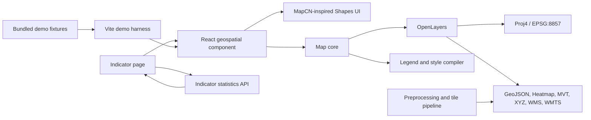
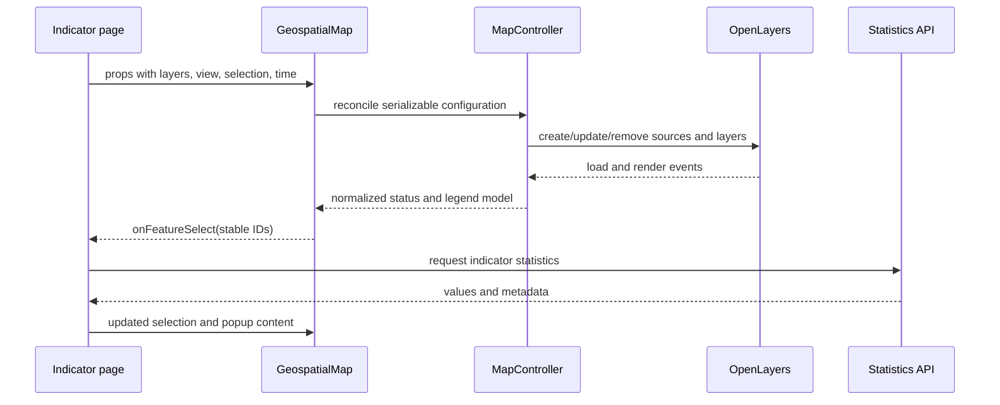

# Geospatial Map Component — Technical Architecture

Status: proposed implementation baseline

Related requirements: [`requirements.md`](./requirements.md)

## 1. Architecture decisions

| Area                  | Decision                                                                                                            |
| --------------------- | ------------------------------------------------------------------------------------------------------------------- |
| Application framework | React with TypeScript                                                                                               |
| Map engine            | OpenLayers                                                                                                          |
| Projection support    | Standard Equal Earth, ArcGIS Equal Earth (11° central meridian), and built-in Web Mercator                          |
| UI system             | Composable map parts built on product-owned Shapes primitives (`shapes.tsx`), shadcn-style CSS tokens; Lucide icons |
| Packaging             | One copy-paste source folder (shadcn-style, no build) plus one Vite demo application that consumes it               |
| Public API            | Declarative, serializable layer/style/legend configuration and typed events                                         |
| Map engine boundary   | OpenLayers classes remain private to the map package                                                                |
| Basemaps              | Bundled vector fallback for both projections; optional ArcGIS Equal Earth MVT and OpenStreetMap Mercator sources    |
| Data preparation      | Geometry matching, repair, simplification, and tile generation happen before browser delivery                       |
| Demo strategy         | Static, deterministic fixtures first; optional network sources are clearly marked and never required to see a map   |
| Testing               | Unit tests for pure configuration logic and browser tests for visible rendering and interaction                     |

### 1.1 MapCN and Shapes integration

“Shapes” is treated as the product's React UI component system. Map controls follow the composable, product-owned approach documented by [MapCN](https://www.mapcn.dev/docs): compact floating surfaces, shadcn-style design tokens, Lucide icons, accessible labels, and responsive popover/drawer behavior.

MapCN's map primitives use MapLibre GL, so they are not imported as the rendering engine: replacing OpenLayers would remove the required Equal Earth projection and conflict with the source architecture below. Instead, the package owns the equivalent React/Shapes controls and MapCN-inspired styling while OpenLayers renders geographic content only. Small legend samples use accessible inline SVG or CSS because they represent map symbols rather than general interface controls.

## 2. Design principles

1. **One canonical map state.** Store center in longitude/latitude and zoom independently of the active projection.
2. **Configuration in, events out.** Applications provide serializable configuration; the component emits stable, application-level events.
3. **No application networking in the renderer.** The host retrieves indicator statistics and updates props after a selection event.
4. **Style and legend share one model.** Classification is calculated once and drives both rendered symbols and the legend.
5. **Basemaps declare projection compatibility.** The component never silently shows a geometrically invalid source.
6. **Static demo data is the baseline.** The component must remain visible when optional third-party services are unavailable.
7. **Add scale only when measured.** Begin with GeoJSON for small fixtures and add vector tiles or workers where performance fixtures justify them.

## 3. System context



The indicator page owns filters, URLs, data permissions, and retrieved statistics. The map owns rendering, view state, geographic hit detection, layer state, legends, and map-specific controls.

## 4. Repository shape

Use a small pnpm workspace. The component is delivered as a **copy-paste source folder** in the style of shadcn/ui: host teams copy `packages/geospatial-map/src` into their application and own the code from then on. The folder has no build step and no path aliases, and it imports nothing from outside itself.

```text
/
├── apps/
│   └── demo/                      imports the folder as @/components/geospatial-map
│       ├── public/data/
│       ├── src/App.tsx
│       ├── src/ComposedScenario.tsx
│       └── src/demo-config.ts
├── packages/
│   └── geospatial-map/            private workspace package (not published)
│       ├── src/                   ← the folder host apps copy
│       │   ├── README.md          install, composition, styling
│       │   ├── geospatial-map.css tokens and all styles
│       │   ├── geospatial-map.tsx preset layout (<GeospatialMap>)
│       │   ├── map-root.tsx       <MapRoot>: frame, viewport, context
│       │   ├── use-map-engine.ts  controller lifecycle, state, actions
│       │   ├── map-context.ts     useMap(), useMapActions()
│       │   ├── map-controls.tsx … map-attribution.tsx   composable parts
│       │   ├── map-grid.tsx
│       │   ├── shapes.tsx         UI primitives (swap point for the design system)
│       │   ├── icons.ts           icon swap point
│       │   ├── docs/              guides, copied with the folder
│       │   ├── examples/          type-checked task examples, copied with the folder
│       │   ├── AGENTS.md          instructions for coding agents in the receiving app
│       │   ├── config.ts  types.ts  messages.ts  theme.ts  map-state.ts  utils.ts
│       │   └── core/              OpenLayers engine, React-free
│       │       ├── map-controller.ts  layer-factory.ts  style-compiler.ts
│       │       ├── legend-model.ts  projections.ts  canvas-theme.ts
│       │       └── svg-export.ts  embed.ts  errors.ts  symbology-presets.ts
│       └── test/                  unit, SSR, portability, styling-contract, consumer-compile
├── tests/browser/
├── scripts/write-schema.mjs
├── package.json
├── pnpm-workspace.yaml
└── tsconfig.base.json
```

The folder is one distributable unit, not separate core, React, UI, legend, and export packages. Internal boundaries are kept by convention and by tests:

- `core/` never imports React.
- Only `core/` imports OpenLayers.
- The parts reach the map only through the context and actions.
- Portability tests check that relative imports stay inside the folder, that the only bare imports are the declared dependencies, and that the folder compiles under a fresh app's strict TypeScript settings.

## 5. Runtime architecture

### 5.1 React composition layer

`GeospatialMap` is the public component. It:

- Creates one `MapController` after the browser DOM target is mounted.
- Reconciles changed props without recreating unchanged sources or the map instance.
- Renders Shapes controls around the OpenLayers viewport.
- Converts controller events into typed React callbacks.
- Destroys listeners, sources, observers, and the OpenLayers target on unmount.
- Uses `ResizeObserver` to call `map.updateSize()` when the container changes.

The React component must not directly build OpenLayers layers in render functions. That work belongs to `MapController`, which allows lifecycle behavior to be tested without coupling it to React re-renders.

### 5.2 Map core

`MapController` owns exactly one OpenLayers `Map` and exposes application-level commands:

```ts
type MapController = {
  setView(view: MapViewState): void
  setProjection(projection: ProjectionId): void
  setLayers(layers: MapLayerConfig[]): void
  setSelection(selection: MapSelection | null): void
  setTime(time: string | null): void
  fit(target: FitTarget, options?: FitOptions): void
  exportImage(options: ExportOptions): Promise<Blob>
  destroy(): void
}
```

The controller contains the minimum state required to reconcile OpenLayers objects:

- Canonical view state.
- Layer registry keyed by stable layer ID.
- Active basemap ID.
- Active selection.
- Current time.
- In-flight source state and errors.
- Compiled style and legend models.

The controller does not store host popup content, fetched statistics, application filters, or authentication state.

### 5.3 UI component tree

`MapRoot` owns the controller, state, and context; every visible piece is a separate part. The `GeospatialMap` preset renders the parts below in this order, each enabled by `config.ui`. Host applications can instead compose any subset inside `MapRoot`, or add their own parts that use `useMap()`.

```text
MapRoot                       section.geo-map-root > div.geo-map-stage > div.geo-map-viewport (OpenLayers)
├── MapControls               MapCN-style grouped icon controls
│   └── MapControlGroup
│       ├── MapZoomInButton / MapZoomOutButton / MapResetZoomButton
│       ├── MapLocateButton
│       ├── MapLayersButton
│       ├── MapFitButton
│       ├── MapSettingsButton
│       ├── MapFullscreenButton
│       └── MapControlButton  host-defined controls
├── MapSettings               projection, basemap, area and export fields
├── MapBreadcrumbs            optional Admin 0/1/2 path
├── MapLayerPanel             visibility, opacity, order, status
├── MapLegend                 MapLegendSymbol per entry
├── MapPopup                  optional, host content
├── MapStatus                 loading / no-data chips
├── MapTimeControls           optional
├── MapErrorAlert             recoverable errors
└── MapAttribution
```

The CSS is token-based (`--geo-*`, shadcn naming, light and dark), and every rule has single-class specificity, so host stylesheets override it without `!important`. The OpenLayers canvas (labels, selection) and exported reports read the same tokens at runtime.

### 5.4 Shapes component mapping

| Map UI                        | Shapes component                                                   |
| ----------------------------- | ------------------------------------------------------------------ |
| Zoom, reset zoom, locate, fit | Grouped icon `Button` with tooltip and accessible name             |
| Projection and basemap        | `Select`                                                           |
| Layer visibility              | `Switch` or `Checkbox`                                             |
| Layer ordering                | Small up/down `Button` controls initially                          |
| Layer settings                | `Sheet` on narrow screens, `Popover` or side panel on wide screens |
| Legend container              | `Card`, optional `Accordion` for multiple layers                   |
| Time selection                | `Slider` plus labeled value                                        |
| Export actions                | `DropdownMenu`                                                     |
| Feature details               | `Popover` on desktop and `Sheet` on narrow screens                 |
| Loading                       | `Skeleton` and non-blocking status text                            |
| Source failure                | `Alert` scoped to the failed layer                                 |
| Current hierarchy             | `Breadcrumb`                                                       |

Initial layer reordering uses explicit up/down buttons. Drag-and-drop can be added after user testing demonstrates a need; it is not needed to satisfy ordering or keyboard accessibility.

## 6. Public React API

```ts
export type ProjectionId = 'EPSG:8857' | 'ESRI:EQUAL-EARTH-CM11' | 'EPSG:3857'

export type MapViewState = {
  center: [longitude: number, latitude: number]
  zoom: number
  projection: ProjectionId
  rotation?: number
}

export type MapSelection = {
  layerId: string
  featureId: string
  boundarySetId?: string
  geographyLevel?: string
}

export type MapRootProps = MapCallbacks &
  HTMLAttributes<HTMLElement> & {
    config: GeospatialMapConfigV1
    state?: MapState
    onStateChange?: (state: MapState, change: MapStateChange) => void
    children?: ReactNode // composable parts
  }

export type GeospatialMapProps = MapRootProps & {
  slots?: MapSlots // preset only
}
```

`<MapRoot>` provides the map to its children through context (`useMap()`, `useMapActions()`).
`<GeospatialMap>` is the preset that composes every part from `config.ui` and `slots`.

`config` is a strict versioned JSON contract. Controlled `state` wins when supplied;
otherwise, the component owns state from `config.initialState`. Profile defaults are resolved
before config overrides, nested objects merge, and arrays replace. Runtime callbacks and React
slots remain outside JSON configuration.

The canonical contract is one TypeBox schema. `GeospatialMapConfigV1` is inferred from that schema,
`validateMapConfig` evaluates the same schema plus semantic cross-field rules, and `pnpm schema`
writes that same in-memory object (exported as `mapConfigSchema`) to `map-config.schema.json`, so the
runtime and distributed schema cannot drift.

### 6.1 Imperative access

Only operations that do not fit normal React data flow are exposed through a ref:

```ts
export type GeospatialMapHandle = {
  fit(target: FitTarget, options?: FitOptions): void
  fitSelection(options?: FitOptions): boolean
  exportImage(options: ExportOptions): Promise<Blob>
  getState(): MapState
}
```

Layer changes, selection, projection, and time remain props rather than imperative commands.

## 7. Layer and source contracts

All public configurations are JSON-serializable except React render callbacks.

```ts
type CommonLayerConfig = {
  id: string
  title: string
  role: 'basemap' | 'indicator' | 'boundary' | 'reference'
  visible?: boolean
  opacity?: number
  minZoom?: number
  maxZoom?: number
  zIndex?: number
  selectable?: boolean
  featureIdField?: string
  boundarySetId?: string
  geographyLevel?: string
  attribution?: AttributionSpec[]
  time?: LayerTimeSpec
  legend?: LegendSpec
}

export type MapLayerConfig =
  | (CommonLayerConfig & GeoJsonLayerConfig)
  | (CommonLayerConfig & HeatmapLayerConfig)
  | (CommonLayerConfig & VectorTileLayerConfig)
  | (CommonLayerConfig & XyzLayerConfig)
  | (CommonLayerConfig & WmsLayerConfig)
  | (CommonLayerConfig & WmtsLayerConfig)
```

### 7.1 GeoJSON source

```ts
type GeoJsonLayerConfig = {
  kind: 'geojson'
  data: GeoJSON.FeatureCollection | { url: string }
  dataProjection?: 'EPSG:4326' | string
  style: ThematicStyleSpec
}
```

### 7.2 Heatmap source

`HeatmapLayerConfig` reuses the GeoJSON loader and adds JSON-safe weight, gradient, radius, blur, and zoom-stop fields. OpenLayers' WebGL heatmap remains private to the renderer. Heatmaps are aggregate and non-selectable; PNG/JPEG preserve the rendered canvas and SVG uses the labeled raster wrapper.

The documented default source CRS is `EPSG:4326`. A source with another CRS must declare it. Inline data is appropriate for tests and small fixtures; URL data is appropriate for cacheable static assets.

### 7.3 Vector-tile source

```ts
type VectorTileLayerConfig = {
  kind: 'mvt'
  urlTemplate: string
  sourceProjection: string
  sourceLayer?: string
  maxSourceZoom?: number
  style: ThematicStyleSpec
}
```

MVT is the preferred browser delivery for detailed Admin 1/Admin 2 geometry and dense global data. Tile generation is external to the component.

### 7.4 Raster sources

```ts
type XyzLayerConfig = {
  kind: 'xyz'
  urlTemplate: string
  sourceProjection: string
  crossOrigin?: 'anonymous'
}

type WmsLayerConfig = {
  kind: 'wms'
  url: string
  params: Record<string, string | number | boolean>
  sourceProjection: string
  tiled?: boolean
}

type WmtsLayerConfig = {
  kind: 'wmts'
  url: string
  layer: string
  matrixSet: string
  format: string
  sourceProjection: string
  tileGrid: WmtsTileGridSpec
}
```

Raster layers declare whether browser export is permitted and whether the source sends compatible CORS headers. Client-side reprojection is allowed but should not be the default for high-volume or high-detail production rasters.

### 7.5 Runtime validation

TypeScript protects code authored in the same build but does not validate server JSON. The package validates externally loaded layer manifests at the trust boundary and reports a structured `CONFIG_INVALID` error with layer ID and field path. Use a small explicit validator first; add a schema library only if the host already uses one or the contract becomes too large to maintain safely by hand.

## 8. Data lifecycle



### 8.1 Reconciliation rules

- Stable layer IDs are mandatory.
- Unchanged source identity preserves its OpenLayers source and cache.
- Style-only changes update style functions without recreating source data.
- Visibility, opacity, and order update existing layer properties.
- A changed URL, source projection, format, or tile grid replaces the source.
- Removed layers release listeners and references.
- New view/filter/time changes supersede obsolete asynchronous requests.

## 9. Projection architecture

### 9.1 Registration

Register Equal Earth once before creating a view:

```ts
proj4.defs('EPSG:8857', '+proj=eqearth +lon_0=0 +datum=WGS84 +units=m +no_defs +type=crs')
register(proj4)
```

The registered OpenLayers projection receives global/world extents appropriate to Equal Earth and `setGlobal(true)`. Web Mercator is provided by OpenLayers.

The ArcGIS Equal Earth vector basemap is registered separately as `ESRI:EQUAL-EARTH-CM11` because its service definition uses an 11° central meridian. It renders in that native projection to avoid global-edge artifacts; it must not be mislabeled as standard `EPSG:8857`.

### 9.2 Canonical state

The public state always stores:

- Center as `[longitude, latitude]` in WGS 84.
- Canonical zoom, independent of OpenLayers resolution arrays.
- Rotation in radians.
- Active projection ID.

When projection changes, the controller:

1. Reads the canonical center, zoom, and rotation.
2. Chooses a compatible basemap or documented fallback.
3. Creates a new OpenLayers `View` in the target projection.
4. Transforms the canonical center into the target projection.
5. Converts canonical zoom to the target view resolution.
6. Applies constraints and restores selection and active extent.
7. Emits one `projectionchange` event after the new view is ready.

OpenLayers requires replacing the `View` when its projection changes; mutating a projection on an existing view is not supported.

### 9.3 Automatic switching

Automatic switching is opt-in. The default thresholds are:

- Equal Earth below canonical zoom `3.5`.
- Preserve the current projection from `3.5` through `4.0`.
- Web Mercator at canonical zoom `4.0` and above.

The gap is hysteresis that prevents rapid projection changes near one zoom boundary. Manual projection choice suspends automatic switching until the host re-enables it.

### 9.4 Dateline behavior

Global polygon data must be cut or normalized at the antimeridian during preprocessing. The renderer sets intentional `wrapX` behavior per source. Coarse polygons that cross the dateline must not be patched ad hoc in the browser because the same defect will recur at each LOD and projection.

## 10. Basemap architecture

### 10.1 Basemap contract

```ts
export type BasemapConfig = {
  id: string
  title: string
  supportedProjections: ProjectionId[]
  layers: MapLayerConfig[]
  backgroundColor: string
  attribution: AttributionSpec[]
  exportable: boolean
  fallbackFor?: ProjectionId[]
}
```

A basemap is a named group of non-selectable layers at the bottom of the layer stack. Only one basemap is active at a time. Indicator, boundary, and reference overlays remain unchanged when the basemap changes.

### 10.2 Demo basemap catalog

| ID                      | Projection  | Source                                                                           | Purpose                                            |
| ----------------------- | ----------- | -------------------------------------------------------------------------------- | -------------------------------------------------- |
| `reference-equal-earth` | `EPSG:8857` | Bundled simplified Admin 0 GeoJSON in `EPSG:4326`, optional bundled label points | Reliable global Equal Earth view                   |
| `reference-mercator`    | `EPSG:3857` | The same bundled reference geometry, rendered in Mercator                        | Offline/export-safe Mercator comparison            |
| `osm-mercator`          | `EPSG:3857` | OpenStreetMap XYZ tiles                                                          | Familiar street/context view for local interaction |

The two reference basemaps intentionally share one small source fixture while defining projection-specific view defaults and styles. Water is the map background; land, coastlines, boundaries, and optional labels are vector layers.

### 10.3 Projection switching and fallback

- If the active basemap supports the target projection, keep it.
- Otherwise choose the first configured fallback for the target projection.
- In the demo, `osm-mercator` falls back to `reference-equal-earth` when switching to Equal Earth.
- Returning to Mercator may restore the last manually selected Mercator basemap.
- Every automatic fallback is reflected in controlled state and announced to assistive technology.

### 10.4 Why Equal Earth uses a vector reference basemap

OpenLayers can reproject Web Mercator raster tiles to Equal Earth, which is useful for compatible overlays and diagnostics. It is not the default Equal Earth basemap because it adds client work, creates visible reprojection artifacts at some scales, complicates export, and retains map content designed for Mercator. A small vector basemap is predictable, cacheable, projection-correct, and easy to include in the demo.

The bundled demo fixture is not automatically approved for official publication. Production applications replace it with a preprocessed approved boundary source and retain that source's attribution, version, and boundary policy.

## 11. Symbology

### 11.1 Style model

The public style model is deliberately smaller than the complete OpenLayers style API:

```ts
type ThematicStyleSpec =
  | { type: 'constant'; symbol: SymbolSpec }
  | {
      type: 'categorical'
      field: string
      categories: Array<{ value: string | number | boolean; label: string; symbol: SymbolSpec }>
      fallback?: LegendClass
    }
  | {
      type: 'graduated'
      field: string
      classes: Array<{ min?: number; max?: number; label: string; symbol: SymbolSpec }>
      missing?: LegendClass
    }
  | {
      type: 'continuous'
      field: string
      domain: [number, number]
      stops: Array<{ value: number; color: string }>
      clamp?: boolean
      missing?: LegendClass
    }

type SymbolSpec = PointSymbol | LineSymbol | PolygonSymbol
```

`PointSymbol`, `LineSymbol`, and `PolygonSymbol` contain only the requested color, opacity, size, shape, width, dash, label, and zoom-scaling properties. They do not expose OpenLayers constructors.

### 11.2 Compilation

`compileThematicStyle(spec, metadata)` returns:

```ts
type CompiledStyle = {
  openLayersStyle: unknown
  legend: NormalizedLegend
  warnings: StyleWarning[]
}
```

Both outputs derive from the same normalized classes. A style change therefore cannot leave a stale legend. Compiled style objects are memoized by stable configuration identity; feature values are not copied into React state.

### 11.3 Zoom-dependent symbols

Symbol specifications choose one of two size modes:

- `screen`: size remains in CSS pixels while zooming.
- `scale`: size is interpolated between declared zoom stops.

Layers independently declare `minZoom` and `maxZoom`. Geometry LOD and feature density come from source selection or tiles, not from the symbol compiler.

## 12. Legend architecture

### 12.1 Legend contract

```ts
type LegendSpec = {
  title?: string
  subtitle?: string
  units?: string
  description?: string
  sourceNote?: string
  presentation?: 'list' | 'continuous-ramp' | 'size-ramp'
  entries?: LegendEntry[]
  showLayerToggle?: boolean
}

type LegendEntry = {
  id: string
  label: string
  symbol: SymbolSpec | { gradient: Array<{ value: number; color: string }> }
  value?: string | number | [number, number]
}
```

### 12.2 Generation rules

- `constant`, `categorical`, and `graduated` styles generate discrete entries.
- `continuous` styles generate a color ramp with min/max labels and optional intermediate ticks.
- Explicit legend text may override generated labels but not classification boundaries.
- Missing, suppressed, and not-applicable values receive separate entries when configured.
- Raster layers may supply a legend independently because their pixel styling can occur on a server.
- Hidden layers are omitted or shown disabled according to `showLayerToggle`.
- Entries are ordered exactly as the corresponding classification or server metadata.

### 12.3 Legend rendering

`MapLegend` receives normalized legend data, not OpenLayers layers. It uses Shapes `Card` and `Accordion` components and renders each mark with a small SVG:

- Circle, square, triangle, or configured point shape.
- Line sample with width and dash.
- Polygon sample with fill and stroke.
- Continuous SVG gradient.
- Proportional size sequence.

Every visual mark has adjacent text. The legend remains useful without color perception and is included in the export composition.

## 13. Interaction and indicator statistics

### 13.1 Hit detection

The controller performs OpenLayers hit detection against visible selectable layers in descending display order. A configurable hit tolerance accommodates touch. If multiple layers return features at the same pixel, the event includes ordered candidates; the host can choose the top result or show a Shapes selection menu.

```ts
type FeatureEvent = {
  mapId: string
  layerId: string
  featureId: string
  boundarySetId?: string
  geographyLevel?: string
  coordinate: [longitude: number, latitude: number]
  properties: Record<string, JsonValue>
  candidates?: FeatureCandidate[]
  interaction: 'click' | 'tap' | 'keyboard' | 'external'
}
```

Only allowlisted properties are emitted. Stable IDs come from `featureIdField`; display names are not used as identity.

### 13.2 Selection and highlighting

Selection is a separate rendering layer or overlay style keyed by `{layerId, featureId}`. It is not implemented by mutating source features. This preserves source data, survives style changes, and allows external filter selection to use the same path as map clicks.

### 13.3 Popup flow

1. User selects a feature.
2. The map emits stable geographic identifiers immediately.
3. The host shows loading popup content and requests statistics.
4. The host supplies success, no-data, or error content through typed React slots.
5. Closing the popup asks the host to clear controlled selection.

The package never injects arbitrary feature HTML and never knows the indicator API URL.

### 13.4 Hierarchy and fit

`ZoomTarget` contains a stable ID, label, optional parent ID, geographic level, and extent in longitude/latitude. Admin breadcrumbs are host-configured data rendered by the map UI. `fit()` transforms the WGS 84 extent into the active projection and applies padding, duration, and maximum zoom.

## 14. Time architecture

The host supplies the canonical timeline. Layers declare how a canonical time becomes source state:

```ts
type LayerTimeSpec = {
  available: string[]
  mode: 'property' | 'url-template' | 'wms-parameter' | 'source-replacement'
  fieldOrParameter?: string
  missingPolicy?: 'hide' | 'unavailable' | 'retain-last'
}
```

- `property` filters vector features already loaded.
- `url-template` substitutes an encoded time token.
- `wms-parameter` updates the WMS `TIME` parameter.
- `source-replacement` loads a time-specific source URL.

`TimeControls` is a controlled Shapes UI. Playback is a small interval state machine owned by React. It advances only after required layers for the current frame are ready or a configured timeout is reported. Prefetching is bounded to the next one or two frames initially.

## 15. Map grid

`MapGrid` composes up to six ordinary `GeospatialMap` instances. It does not introduce a second renderer.

```ts
type MapGridProps = {
  config: MapGridConfigV1
  state?: MapGridState
  slots?: MapSlots
  onStateChange?: (state: MapGridState, mapId: string, change: MapStateChange) => void
}
```

Indicator, time, style, and layer metadata are shared through `config.shared`. Each cell has an
independent state by default. The grid has separate view, layer, time, and selection synchronization
policies and identifies the origin map in its unified state callback.

## 16. Export and embedding

### 16.1 Image export

The initial export path is client-side PNG/JPEG:

1. Wait for visible required layers to reach ready or error state.
2. Render the map at the requested pixel dimensions.
3. Composite OpenLayers canvases using each canvas transform and opacity.
4. Draw report title, active time, selected area, legend, attribution, and source note.
5. Return a `Blob` without triggering a download automatically.

The host chooses whether to download, upload, or insert the blob into a report. A source without valid CORS headers marks the export unavailable and identifies the blocking layer.

Vector-only GeoJSON compositions use the package's vector-native SVG renderer. When any visible raster or vector-tile layer prevents exact serialization, the export falls back to an SVG containing the rasterized composition and labels its metadata `svg-wrapper` rather than presenting it as vector-native output.

### 16.2 Embed configuration

The component can serialize JSON-safe state:

- View and projection.
- Active basemap.
- Public layer IDs and state.
- Time and symbology configuration.
- Selection only when explicitly allowed.
- UI control visibility.

Callbacks, credentials, inline private data, and arbitrary HTML are never serialized. The publishing application stores this configuration and generates the iframe or loader code; the component does not run a publishing service.

## 17. Performance architecture

### 17.1 Browser work

- Keep static sources cacheable and versioned.
- Reuse source instances when only styles or visibility change.
- Use MVT for detailed boundaries and large feature collections.
- Use raster pyramids or tiled services for raster data.
- Declutter labels and cap hit detection to visible/selectable layers.
- Keep pointer-move events throttled to one animation frame.
- Abort or supersede obsolete fetches.
- Lazy-load the map package from the indicator page when appropriate.

Web workers are not part of the first implementation. Add them only if profiling shows parsing or classification blocks the main thread after normal tiling and source-size controls are in place.

### 17.2 Public traffic

The component is stateless browser code. Public-user scale is handled primarily by:

- CDN delivery of JavaScript, GeoJSON, vector tiles, raster tiles, and embed configurations.
- Immutable/versioned URLs and long cache lifetimes.
- Cacheable statistics requests where policy permits.
- No per-session map server work for bundled reference layers.
- Rate limiting and authorization in host services, outside the component.

## 18. Error model

```ts
type MapErrorCode =
  | 'CONFIG_INVALID'
  | 'PROJECTION_UNSUPPORTED'
  | 'BASEMAP_INCOMPATIBLE'
  | 'SOURCE_LOAD_FAILED'
  | 'STYLE_INVALID'
  | 'FEATURE_ID_MISSING'
  | 'TIME_FRAME_FAILED'
  | 'EXPORT_CORS_BLOCKED'
  | 'EXPORT_TIMEOUT'

type MapError = {
  code: MapErrorCode
  message: string
  recoverable: boolean
  layerId?: string
  cause?: unknown
}
```

Optional layer failure leaves the rest of the map running and displays a layer-scoped Shapes `Alert`. Invalid projection or missing required basemap produces a map-level error state. Raw URLs, credentials, or response bodies are not exposed in user-visible errors.

## 19. Accessibility

- All Shapes controls have accessible names and visible focus.
- Map keyboard controls support pan and zoom without trapping focus.
- Projection, basemap, time, selection, and loading changes use a polite live region.
- Popup content is reachable and closable by keyboard without losing a sensible focus return target.
- Touch targets meet the design-system minimum size.
- Time playback respects `prefers-reduced-motion` and never auto-starts.
- Legend entries pair text with every visual mark.
- The host provides a synchronized table or list for complete non-map data access.
- The map viewport has one concise label rather than exposing the internal canvas as meaningful DOM.

## 20. Demo harness

### 20.1 Purpose

The demo is a small Vite React app that proves the package is visible, interactive, and integrable. It is not a second product and does not need Storybook initially.

Run target:

```bash
pnpm dev
```

The command starts the demo and watches the map package. The default route renders a useful map immediately without credentials or backend services.

### 20.2 Demo layout

```text
┌──────────────────────────────────────────────────────────────┐
│ Scenario                                      | Style map ▾  │
├──────────────────────────────────────────────────────────────┤
│ Breadcrumbs                              ┌──────── controls ┐│
│                                          │ + / −            ││
│               interactive map            │ reset / locate   ││
│                                          │ layers / options ││
│ Legend                                   │ fullscreen       ││
├──────────────────────────────────────────────────────────────┤
│ Event log and current serializable state                     │
└──────────────────────────────────────────────────────────────┘
```

The right-side control rail follows MapCN's compact grouped-control pattern. Secondary projection, basemap, area, and export fields stay in an adjacent settings panel. The event log displays recent typed events and makes integration behavior inspectable without developer tools.

### 20.3 Demo scenarios

| Scenario          | Demonstrates                                                              |
| ----------------- | ------------------------------------------------------------------------- |
| Global choropleth | Equal Earth, polygons, graduated color, generated legend, click selection |
| Local detail      | Mercator, OSM basemap, country zoom target, Admin hierarchy               |
| Geometry types    | Point size/shape, line width/dash, polygon fill on one map                |
| Layers            | Visibility, opacity, ordering, multiple indicators and boundaries         |
| Time series       | Controlled time, playback, legend and vector/raster updates               |
| Raster            | Two independently controlled raster sources and CORS/export status        |
| Grid              | Six region views with shared indicator and time state                     |
| Errors            | Broken optional layer, invalid configuration, unsupported projection      |

All listed scenarios are implemented in the harness. Source-protocol and 50,000-point performance fixtures are also available through query parameters documented in the root README.

### 20.4 Deterministic fixtures

The demo should bundle small, preprocessed fixtures:

- Simplified Admin 0 polygons with stable IDs and source metadata.
- A few Admin 1/Admin 2 polygons for one drill-down path.
- Country/city label points.
- Point and line sample features.
- Indicator values for four time steps, including missing and suppressed values.
- One tiny raster or local tile fixture for deterministic raster checks.

Optional remote sources, including OSM, appear with a network badge and always have a local reference-basemap fallback. Demo data is labeled as demo data and is not represented as publication-approved.

### 20.5 Harness controls

- Scenario select.
- Projection URL parameter (`?projection=`); the projection is a developer setting, so the map itself has no projection select.
- Basemap select.
- Layer panel.
- Time controls.
- Region/zoom-target select.
- Fit-to-data and reset buttons.
- Export menu.
- Current event and state inspector.
- Toggle to simulate loading, no data, source failure, and reduced motion.

## 21. Testing and verification

### 21.1 Unit tests

Keep unit tests focused on pure behavior:

- Projection registration and canonical view conversion.
- Basemap compatibility and fallback.
- Layer reconciliation decisions.
- Style normalization and legend generation from the same classes.
- Configuration validation and structured errors.
- Time URL/parameter resolution.

### 21.2 Browser tests

Browser tests run against the demo and verify outcomes visible to users:

1. Equal Earth renders land pixels, not only an initialized canvas.
2. Switching to Mercator preserves the canonical center and zoom closely.
3. The basemap fallback changes from OSM to the Equal Earth reference map.
4. Clicking a polygon emits its stable ID and applies highlight styling.
5. External selection highlights the same feature.
6. Layer visibility and ordering change rendered pixels without resetting the view.
7. Legend entries match the active style and time.
8. Hidden-container reveal and resize produce a correctly sized map.
9. PNG export contains map, legend, attribution, and title.
10. Keyboard controls and popup focus behavior work.
11. The 50,000-point fixture remains within the agreed performance budget.
12. All six grid cells render and identify their originating event.

Chromium is required for each change. Firefox and WebKit run in CI before release because canvas, CORS, font, and pointer behavior differ across engines.

### 21.3 Build checks

```bash
pnpm format:check
pnpm lint
pnpm test
pnpm typecheck
pnpm build
pnpm test:browser
```

Do not call the component visually verified unless a browser test or manual inspection confirms actual geographic pixels and interactions.

## 22. Implemented delivery sequence

### Slice 1: Visible map

- Workspace, package, and Vite demo.
- Projection registration and canonical view.
- Bundled reference basemap in Equal Earth and Mercator.
- Optional OSM Mercator basemap.
- One polygon indicator layer.
- Shapes projection/basemap controls and legend.
- Click selection, highlight, event log, resize handling.
- Browser test for visible land pixels and projection switching.

### Slice 2: Complete vector behavior

- Point and line symbolizers.
- Layer panel, ordering, zoom targets, fit, popups, and hierarchy.
- MVT source and LOD fixtures.
- External controlled selection.

### Slice 3: Raster and time

- XYZ, WMS, and WMTS sources.
- Raster legends and compatibility errors.
- Unified time controls and bounded prefetch.

### Slice 4: Grid and publishing

- Six-map composition.
- PNG/JPEG report export.
- Public embed-state serialization.
- Measured production performance budgets.

## 23. Host integration decisions

The component contract and harness are complete without the following product-specific values. A production host must supply or approve them before release:

- Actual Shapes package name, version, import path, theme tokens, and icon set.
- Approved production boundary authority and publication wording.
- Whether automatic projection switching is enabled by default in the host product.
- Production raster endpoints and CORS/export guarantees.
- Statistics API response and authorization contract.
- Final product palette allowlist and per-indicator editable symbology policy; the package provides accessible defaults and constraints.
- Time interval and irregular-observation behavior.
- Product report dimensions, fonts, and branding; the package provides configurable defaults and vector-native/fallback SVG paths.
- Embed host, persistence, origin policy, and revocation.
- Final release device inventory; repository budgets and a desktop automated gate are defined in `performance-budgets.md`.

## 24. Technical risks and mitigations

| Risk                                     | Mitigation                                                                                |
| ---------------------------------------- | ----------------------------------------------------------------------------------------- |
| Raster basemap looks poor in Equal Earth | Use projection-correct vector reference basemap; make raster reprojection opt-in          |
| Projection switch loses view             | Preserve canonical lon/lat center and zoom; replace the OpenLayers view deterministically |
| Large GeoJSON blocks the browser         | Simplify or tile before delivery; enforce performance fixtures                            |
| Style and legend disagree                | Compile both from one normalized classification model                                     |
| Missing feature IDs break interaction    | Validate selectable layer identity before rendering                                       |
| Remote demo source fails                 | Bundle deterministic fixtures and local basemap fallback                                  |
| Export canvas is tainted                 | Require CORS metadata and report the blocking layer                                       |
| Six maps multiply memory/network work    | Share immutable config/data where safe and use tiled/cacheable sources                    |
| UI library leaks into map logic          | Keep Shapes imports in the part files; `core/` never imports React or `shapes.tsx`        |

## 25. Authoritative implementation references

- [OpenLayers Equal Earth GeoJSON example](https://openlayers.org/en/latest/examples/equal-earth-geojson.html)
- [OpenLayers raster reprojection documentation](https://openlayers.org/doc/tutorials/raster-reprojection.html)
- [OpenLayers vector-tile reprojection example](https://openlayers.org/en/latest/examples/vector-tiles-reprojected.html)
- [OpenLayers map export example](https://openlayers.org/en/latest/examples/export-map.html)
- [shadcn/ui component catalog](https://ui.shadcn.com/docs/components), if “Shapes” refers to shadcn/ui
