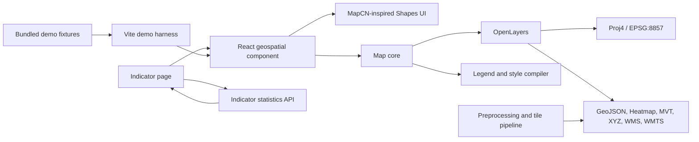
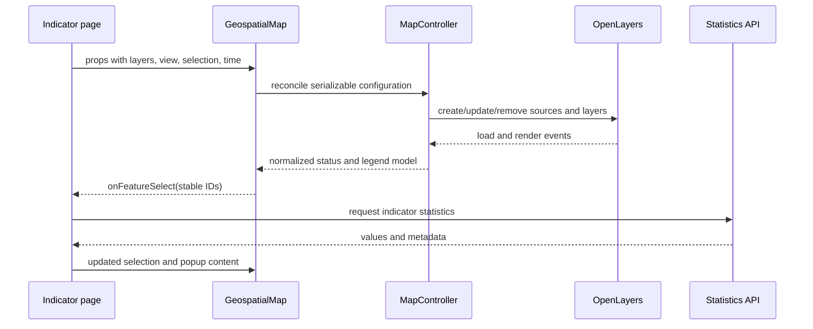

# Geospatial Map Component — Technical Architecture

Status: proposed implementation baseline

Related requirements: [`requirements.md`](./requirements.md)

## 1. Architecture decisions

| Area                  | Decision                                                                                                            |
| --------------------- | ------------------------------------------------------------------------------------------------------------------- |
| Application framework | React with TypeScript                                                                                               |
| Map engine            | OpenLayers                                                                                                          |
| Projection support    | Standard Equal Earth, ArcGIS Equal Earth (11° central meridian), and built-in Web Mercator                          |
| UI system             | Composable map parts built on product-owned Shapes primitives (`shapes.tsx`), shadcn-style CSS tokens; Lucide icons |
| Packaging             | One copy-paste source folder (shadcn-style, no build) plus one Vite demo application that consumes it               |
| Public API            | Declarative, serializable layer/style/legend configuration and typed events                                         |
| Map engine boundary   | OpenLayers classes remain private to the map package                                                                |
| Basemaps              | Bundled vector fallback for both projections; optional ArcGIS Equal Earth MVT and OpenStreetMap Mercator sources    |
| Data preparation      | Geometry matching, repair, simplification, and tile generation happen before browser delivery                       |
| Demo strategy         | Static, deterministic fixtures first; optional network sources are clearly marked and never required to see a map   |
| Testing               | Unit tests for pure configuration logic and browser tests for visible rendering and interaction                     |

### 1.1 MapCN and Shapes integration

“Shapes” is treated as the product's React UI component system. Map controls follow the composable, product-owned approach documented by [MapCN](https://www.mapcn.dev/docs): compact floating surfaces, shadcn-style design tokens, Lucide icons, accessible labels, and responsive popover/drawer behavior.

MapCN's map primitives use MapLibre GL, so they are not imported as the rendering engine: replacing OpenLayers would remove the required Equal Earth projection and conflict with the source architecture below. Instead, the package owns the equivalent React/Shapes controls and MapCN-inspired styling while OpenLayers renders geographic content only. Small legend samples use accessible inline SVG or CSS because they represent map symbols rather than general interface controls.

## 2. Design principles

1. **One canonical map state.** Store center in longitude/latitude and zoom independently of the active projection.
2. **Configuration in, events out.** Applications provide serializable configuration; the component emits stable, application-level events.
3. **No application networking in the renderer.** The host retrieves indicator statistics and updates props after a selection event.
4. **Style and legend share one model.** Classification is calculated once and drives both rendered symbols and the legend.
5. **Basemaps declare projection compatibility.** The component never silently shows a geometrically invalid source.
6. **Static demo data is the baseline.** The component must remain visible when optional third-party services are unavailable.
7. **Add scale only when measured.** Begin with GeoJSON for small fixtures and add vector tiles or workers where performance fixtures justify them.

## 3. System context



The indicator page owns filters, URLs, data permissions, and retrieved statistics. The map owns rendering, view state, geographic hit detection, layer state, legends, and map-specific controls.

## 4. Repository shape

Use a small pnpm workspace. The component is delivered as a **copy-paste source folder** in the style of shadcn/ui: host teams copy `packages/geospatial-map/src` into their application and own the code from then on. The folder has no build step and no path aliases, and it imports nothing from outside itself.

```text
/
├── apps/
│   └── demo/                      imports the folder as @/components/geospatial-map
│       ├── public/data/
│       ├── src/App.tsx
│       ├── src/ComposedScenario.tsx
│       └── src/demo-config.ts
├── packages/
│   ├── geospatial-map-core/       the shared, framework-neutral files and their unit tests;
│   │                              `pnpm sync-core` copies src/ into the folder (never copied by teams)
│   └── geospatial-map/            private workspace package (not published)
│       ├── src/                   ← the folder host apps copy
│       │   ├── README.md          install, composition, styling
│       │   ├── geospatial-map.css tokens and all styles
│       │   ├── geospatial-map.tsx preset layout (<GeospatialMap>)
│       │   ├── map-root.tsx       <MapRoot>: frame, viewport, context
│       │   ├── use-map-engine.ts  controller lifecycle, state, open panel
│       │   ├── map-bridges.ts     actions, controller callbacks, state proposals
│       │   ├── map-context.ts     useMap(), useMapRuntime(), useMapStatic(), useMapActions()
│       │   ├── map-controls.tsx … map-attribution.tsx   composable parts
│       │   ├── map-grid.tsx
│       │   ├── shapes.tsx         UI primitives (swap point for the design system)
│       │   ├── icons.ts           icon swap point
│       │   ├── docs/              guides, copied with the folder
│       │   ├── examples/          type-checked task examples, copied with the folder
│       │   ├── AGENTS.md          instructions for coding agents in the receiving app
│       │   ├── types.ts  component-types.ts  messages.ts  theme.ts  map-state.ts  utils.ts
│       │   ├── config/            schema.ts  normalize.ts  validate.ts  ui-profiles.ts  legacy.ts
│       │   └── core/              OpenLayers engine, React-free
│       │       ├── map-controller.ts  layer-registry.ts  layers/  layer-order.ts
│       │       ├── style-compiler.ts  symbol-rules.ts  symbols.ts  legend-model.ts
│       │       ├── projections.ts  canvas-theme.ts  time.ts  validation.ts
│       │       └── export.ts  report.ts  svg-export.ts  errors.ts  symbology-presets.ts
│       └── test/                  SSR, portability, guides, consumer-compile
├── tests/browser/
├── scripts/                       write-schema.mjs  sync-core.mjs  update-geospatial-map.mjs
├── package.json
├── pnpm-workspace.yaml
└── tsconfig.base.json
```

The folder is one distributable unit, not separate core, React, UI, legend, and export packages. Internal boundaries are kept by convention and by tests:

- `core/` never imports React.
- Only `core/` imports OpenLayers.
- The parts reach the map only through the context and actions. They share a few pure rules with `core/`, such as `canReorder` in `core/layer-order.ts`, so the layer panel and the map agree on which layers can move.
- Portability tests check that relative imports stay inside the folder, that the only bare imports are the declared dependencies, and that the folder compiles under a fresh app's strict TypeScript settings.

Three `core/` files hold rules that several parts of the engine share:

- `core/time.ts`: how a layer follows the time frame (its URL, a WMS parameter, or a feature property) and which frames it has. Validation uses it too.
- `core/symbols.ts`: which symbol draws a feature, its size at the current zoom, its colours and point shape. The canvas renderer, the GPU renderer and the SVG export all use it.
- `core/layer-order.ts`: `canReorder`, used by the layer panel and the map.

## 5. Runtime architecture

### 5.1 React composition layer

`GeospatialMap` is the public component. It:

- Creates one `MapController` after the browser DOM target is mounted.
- Reconciles changed props without recreating unchanged sources or the map instance.
- Renders Shapes controls around the OpenLayers viewport.
- Converts controller events into typed React callbacks (`map-bridges.ts`). The controller acts first; the bridge then proposes the new state. A host controlling `state` answers with its next `state`, and when that differs from the proposal, the map is set back to the host's state.
- Destroys listeners, sources, observers, and the OpenLayers target on unmount.
- Uses `ResizeObserver` to call `map.updateSize()` when the container changes.

The React component must not directly build OpenLayers layers in render functions. That work belongs to `MapController`, which allows lifecycle behavior to be tested without coupling it to React re-renders.

### 5.2 Map core

`MapController` owns exactly one OpenLayers `Map` and exposes application-level commands:

```ts
type MapController = {
  update(options: MapControllerOptions, resync?: boolean): void
  setView(view: Partial<MapViewState>, origin?: MapOrigin): void
  setBasemap(id: string): boolean
  setSelection(selection: MapSelection | null): void
  setTime(time: string | null, origin?: MapOrigin): void
  fit(target: FitTarget, options?: FitOptions): void
  exportImage(options: ExportOptions): Promise<Blob>
  destroy(): void
}
```

Each map has one projection. The controller creates its OpenLayers view once, in the projection of `initialState.view.projection` (or an ArcGIS basemap's own), and keeps it for its whole life. A config with another projection, or other interactions, builds a new controller.

`update()` applies new options from React. Layers are added and removed in place, so layers the host added through `onOpenLayersMap` and listeners on the layer collection survive a change of the configured layers. With `resync`, the host answered a proposed state with another one, and the controller sets the map back to the host's state. `destroy()` disposes the OpenLayers map.

The controller contains the minimum state required to reconcile OpenLayers objects:

- Canonical view state.
- Layer registry keyed by stable layer ID.
- Active basemap ID.
- Active selection.
- Current time.
- In-flight source state and errors.
- Compiled style and legend models.

The controller does not store host popup content, fetched statistics, application filters, or authentication state.

### 5.3 UI component tree

`MapRoot` owns the controller, state, the open panel, and context; every visible piece is a separate part. The `GeospatialMap` preset renders the parts below in this order, each enabled by `config.ui`. Host applications can instead compose any subset inside `MapRoot`, or add their own parts that use `useMap()`.

```text
MapRoot                       section.geo-map-root > div.geo-map-stage > div.geo-map-viewport (OpenLayers)
├── MapControls               MapCN-style grouped icon controls
│   └── MapControlGroup
│       ├── MapZoomInButton / MapZoomOutButton / MapResetZoomButton
│       ├── MapLocateButton
│       ├── MapLayersButton
│       ├── MapFitButton
│       ├── MapSettingsButton
│       ├── MapFullscreenButton
│       └── MapControlButton  host-defined controls
├── MapSettings               basemap (in the map's projection), area and export fields
├── MapBreadcrumbs            optional path of zoom targets (ui.breadcrumbs.targets)
├── MapLayerPanel             visibility, opacity, order, status, under group headings
├── MapLegend                 MapLegendSymbol per entry
├── MapPopup                  optional, host content
├── MapStatus                 loading / no-data chips
├── MapTimeControls           optional
├── MapErrorAlert             recoverable errors
└── MapAttribution
```

The CSS is token-based (`--geo-*`, shadcn naming, light and dark), and every rule has single-class specificity, so host stylesheets override it without `!important`. The OpenLayers canvas (labels, selection) and exported reports read the same tokens at runtime.

### 5.4 Shapes component mapping

| Map UI                        | Shapes component                                                   |
| ----------------------------- | ------------------------------------------------------------------ |
| Zoom, reset zoom, locate, fit | Grouped icon `Button` with tooltip and accessible name             |
| Basemap                       | `Select`                                                           |
| Layer visibility              | `Switch` or `Checkbox`                                             |
| Layer ordering                | Small up/down `Button` controls initially                          |
| Layer settings                | `Sheet` on narrow screens, `Popover` or side panel on wide screens |
| Legend container              | `Card`, optional `Accordion` for multiple layers                   |
| Time selection                | `Slider` plus labeled value                                        |
| Export actions                | `DropdownMenu`                                                     |
| Feature details               | `Popover` on desktop and `Sheet` on narrow screens                 |
| Loading                       | `Skeleton` and non-blocking status text                            |
| Source failure                | `Alert` scoped to the failed layer                                 |
| Zoom-target path              | `Breadcrumb`                                                       |

Initial layer reordering uses explicit up/down buttons. Drag-and-drop can be added after user testing demonstrates a need; it is not needed to satisfy ordering or keyboard accessibility.

## 6. Public React API

```ts
export type ProjectionId = 'EPSG:8857' | 'EPSG:3857' | (string & {}) // e.g. 'ESRI:EQUAL-EARTH-CM11'

export type MapViewState = {
  center: [longitude: number, latitude: number]
  zoom: number
  projection: ProjectionId
  rotation?: number
}

export type MapSelection = {
  layerId: string
  featureId: string
}

export type MapRootProps = MapCallbacks &
  HTMLAttributes<HTMLElement> & {
    config: MapConfigInput
    state?: MapState
    onStateChange?: (state: MapState, change: MapStateChange) => void
    openPanel?: MapPanelId | null
    onOpenPanelChange?: (panel: MapPanelId | null) => void
    children?: ReactNode // composable parts
  }

export type GeospatialMapProps = MapRootProps & {
  slots?: MapSlots // preset only
}
```

`<MapRoot>` provides the map to its children through context (`useMap()`, `useMapRuntime(select)`,
`useMapStatic()`, `useMapActions()`). `<GeospatialMap>` is the preset that composes every part from
`config.ui` and `slots`; it suits most maps, and `<MapRoot>` with parts suits custom layouts.

`config` is a strict versioned JSON contract. Controlled `state` wins when supplied: the map
proposes each change through `onStateChange`, and when the host keeps another state, the map is
set back to it. Otherwise, the component owns state from `config.initialState`. Each change
carries a `MapOrigin`: `'user'` (someone used the map), `'api'` (a `MapActions` call, from host
code or a built-in control), or `'state'` (the starting state or a new `state` prop). The open
panel (`'layers' | 'settings' | null`) is held by the root the same way, controlled with
`openPanel` and `onOpenPanelChange`. Profile defaults are resolved before config overrides,
nested objects merge, and arrays replace. Runtime callbacks and React slots remain outside JSON
configuration.

The contract is one TypeBox schema in `config/schema.ts`, checked against the TypeScript types at
compile time (`schema-types.test-d.ts`). `pnpm schema` writes the same in-memory objects to
`map-config.schema.json` (`mapConfigSchema`, the complete config) and `map-config-input.schema.json`
(`mapInputSchema`, the short form), so the runtime and distributed schemas cannot drift.

Validation lives in one place. `config/validate.ts` holds every rule: the schema plus the
semantic cross-field rules, and the messages for fields renamed or removed in earlier releases
(`config/legacy.ts`). `validateMapConfig` reports all issues. The renderer checks the same rules
before it builds layers, for configs that skipped `validateMapConfig`; `core/validation.ts`
throws the first issue.

### 6.1 Imperative access

The ref is `MapActions`, the same object as `useMapActions()` and the slots' `actions`:

```ts
export type GeospatialMapHandle = MapActions // excerpt:
// fit(target: FitTarget, options?: FitOptions): void
// fitSelection(options?: FitOptions): boolean
// select(selection: MapSelection | null): void
// setLayerVisibility(layerId: string, visible: boolean): void
// setOpenPanel(panel: MapPanelId | null): void
// exportImage(options: ExportOptions): Promise<Blob>
// getState(): MapState
```

A command proposes state like a user change, with origin `'api'`, so controlled hosts see it
through `onStateChange`. `getState()` returns the view as the map shows it now, also during an
animation. There is no projection command: the projection is part of the config.

## 7. Layer and source contracts

All public configurations are JSON-serializable except React render callbacks.

```ts
type CommonLayerConfig = {
  id: string
  title: string
  visible?: boolean
  opacity?: number
  minZoom?: number
  maxZoom?: number
  reorderable?: boolean
  required?: boolean
  showInLayerControl?: boolean
  group?: string
  exclusiveGroup?: string
  attribution?: AttributionSpec[]
  legend?: LegendSpec
  exportable?: boolean
}

// GeoJSON and vector tile (mvt) layers only.
type SelectableLayerConfig = {
  selectable?: boolean
  featureIdField?: string
  propertyAllowlist?: string[]
}

// GeoJSON, heatmap, mvt, xyz and wms layers.
type TimedLayerConfig = { time?: LayerTimeSpec }

export type MapLayerConfig =
  | GeoJsonLayerConfig // Common & Selectable & Timed
  | HeatmapLayerConfig // Common & Timed
  | VectorTileLayerConfig // Common & Selectable & Timed
  | XyzLayerConfig // Common & Timed
  | WmsLayerConfig // Common & Timed
  | WmtsLayerConfig // Common
  | ArcGISVectorTileLayerConfig // Common
```

Layers draw in list order (and in the order of `state.layers[id].order`); there is no `zIndex`. The layer panel lists layers under their `group` heading. When several selectable features are under a click, the top-most one is selected. Basemap layers (`BasemapLayerConfig`) may also set `aboveOverlays` to draw labels or borders above the data.

### 7.1 GeoJSON source

```ts
type GeoJsonLayerConfig = {
  kind: 'geojson'
  data: GeoJSON.FeatureCollection | { url: string }
  dataProjection?: 'EPSG:4326' | string
  style: ThematicStyleSpec
}
```

### 7.2 Heatmap source

`HeatmapLayerConfig` reuses the GeoJSON loader and adds JSON-safe weight, gradient, radius, blur, and zoom-stop fields. OpenLayers' WebGL heatmap remains private to the renderer. Heatmaps are aggregate and non-selectable; PNG/JPEG preserve the rendered canvas and SVG uses the labeled raster wrapper.

The documented default source CRS is `EPSG:4326`. A source with another CRS must declare it. Inline data is appropriate for tests and small fixtures; URL data is appropriate for cacheable static assets.

### 7.3 Vector-tile source

```ts
type VectorTileLayerConfig = {
  kind: 'mvt'
  urlTemplate: string
  sourceProjection: string
  sourceLayer?: string
  maxSourceZoom?: number
  style: ThematicStyleSpec
}
```

MVT is the preferred browser delivery for detailed Admin 1/Admin 2 geometry and dense global data. Tile generation is external to the component.

### 7.4 Raster sources

```ts
type XyzLayerConfig = {
  kind: 'xyz'
  urlTemplate: string
  sourceProjection: string
  crossOrigin?: 'anonymous'
}

type WmsLayerConfig = {
  kind: 'wms'
  url: string
  params: Record<string, string | number | boolean>
  sourceProjection: string
  tiled?: boolean
}

type WmtsLayerConfig = {
  kind: 'wmts'
  url: string
  layer: string
  matrixSet: string
  format: string
  sourceProjection: string
  tileGrid: WmtsTileGridSpec
}
```

Raster layers declare whether browser export is permitted and whether the source sends compatible CORS headers. Client-side reprojection is allowed but should not be the default for high-volume or high-detail production rasters.

### 7.5 Runtime validation

TypeScript protects code authored in the same build but does not validate server JSON. The host validates externally loaded configs at the trust boundary with `validateMapConfig`, which reports every issue with its field path. Every rule lives in `config/validate.ts`: the TypeBox schema, the cross-field rules (for example, an XYZ layer with `time` must have `{time}` in its URL), and the messages for renamed or removed fields. The renderer runs the same rules before it builds layers (`core/validation.ts`) and reports the first problem as a `CONFIG_INVALID` error with the layer ID.

## 8. Data lifecycle



### 8.1 Reconciliation rules

- Stable layer IDs are mandatory.
- Unchanged source identity preserves its OpenLayers source and cache.
- Style-only changes update style functions without recreating source data.
- Visibility, opacity, and order update existing layer properties.
- A changed URL, source projection, format, or tile grid replaces the source.
- Removed layers release listeners and references, and nothing is drawn for them after removal.
- New view/filter/time changes supersede obsolete asynchronous requests. A layer that loads data for each frame shows only the latest load.
- Layers are added and removed in place; layers the host added through `onOpenLayersMap` are kept.
- A layer that can't be built leaves the map as it was and reports the error.

Each built layer (`BuiltLayer`) has one hook for map changes: `update(change)`, with `change` one of `'zoom'`, `'time'`, `'selection'`, or `'theme'`. The controller calls it on every built layer when that part of the map changes, and the layer redraws what depends on it.

## 9. Projection architecture

### 9.1 Registration

Register Equal Earth once before creating a view:

```ts
proj4.defs('EPSG:8857', '+proj=eqearth +lon_0=0 +datum=WGS84 +units=m +no_defs +type=crs')
register(proj4)
```

The registered OpenLayers projection receives global/world extents appropriate to Equal Earth and `setGlobal(true)`. Web Mercator is provided by OpenLayers.

The ArcGIS Equal Earth vector basemap is registered separately as `ESRI:EQUAL-EARTH-CM11` because its service definition uses an 11° central meridian. It renders in that native projection to avoid global-edge artifacts; it must not be mislabeled as standard `EPSG:8857`.

### 9.2 Canonical state

The public state always stores:

- Center as `[longitude, latitude]` in WGS 84.
- Canonical zoom, independent of OpenLayers resolution arrays.
- Rotation in radians.
- Active projection ID.

The projection is part of the view state so that hosts can read it, but it doesn't change while the map runs.

### 9.3 One projection per map

Each map has one projection, chosen in its config: `initialState.view.projection`, or an ArcGIS basemap's own. There is no projection switching, no projection command, and no projection event. The controller creates the OpenLayers `View` in that projection once. A config that names another projection builds a new map, since OpenLayers can't change the projection of an existing view.

Pages that need Equal Earth for the world and Web Mercator for local detail render two maps, or choose the projection when they build the config.

### 9.4 Dateline behavior

Global polygon data must be cut or normalized at the antimeridian during preprocessing. The renderer sets intentional `wrapX` behavior per source. Coarse polygons that cross the dateline must not be patched ad hoc in the browser because the same defect will recur at each LOD and projection.

## 10. Basemap architecture

### 10.1 Basemap contract

```ts
export type BasemapConfig = {
  id: string
  title: string
  supportedProjections: ProjectionId[]
  layers: BasemapLayerConfig[] // MapLayerConfig & { aboveOverlays?: boolean }
  backgroundColor?: string
  attribution?: AttributionSpec[]
  exportable?: boolean
}
```

A basemap is a named group of non-selectable layers at the bottom of the layer stack; layers with `aboveOverlays` draw above the data (labels, borders). Only one basemap is active at a time. Your layers remain unchanged when the basemap changes, and switching it emits no layer events.

### 10.2 Demo basemap catalog

| ID                      | Projection  | Source                                                                           | Purpose                                            |
| ----------------------- | ----------- | -------------------------------------------------------------------------------- | -------------------------------------------------- |
| `reference-equal-earth` | `EPSG:8857` | Bundled simplified Admin 0 GeoJSON in `EPSG:4326`, optional bundled label points | Reliable global Equal Earth view                   |
| `reference-mercator`    | `EPSG:3857` | The same bundled reference geometry, rendered in Mercator                        | Offline/export-safe Mercator comparison            |
| `osm-mercator`          | `EPSG:3857` | OpenStreetMap XYZ tiles                                                          | Familiar street/context view for local interaction |

The two reference basemaps intentionally share one small source fixture while defining projection-specific view defaults and styles. Water is the map background; land, coastlines, boundaries, and optional labels are vector layers.

### 10.3 Basemaps and the map's projection

- At start, the map uses the requested basemap if it supports the map's projection, and otherwise the first configured basemap that does.
- The basemap picker lists only basemaps that support the map's projection.
- `setBasemap` refuses a basemap that doesn't support it and reports `BASEMAP_INCOMPATIBLE`.
- In the demo, `?projection=EPSG:3857` starts the map in Mercator with `reference-mercator`.

### 10.4 Why Equal Earth uses a vector reference basemap

OpenLayers can reproject Web Mercator raster tiles to Equal Earth, which is useful for compatible overlays and diagnostics. It is not the default Equal Earth basemap because it adds client work, creates visible reprojection artifacts at some scales, complicates export, and retains map content designed for Mercator. A small vector basemap is predictable, cacheable, projection-correct, and easy to include in the demo.

The bundled demo fixture is not automatically approved for official publication. Production applications replace it with a preprocessed approved boundary source and retain that source's attribution, version, and boundary policy.

## 11. Symbology

### 11.1 Style model

The public style model is deliberately smaller than the complete OpenLayers style API:

```ts
type ThematicStyleSpec =
  | { type: 'constant'; symbol: SymbolSpec }
  | {
      type: 'categorical'
      field: string
      categories: Array<{ value: string | number | boolean; label: string; symbol: SymbolSpec }>
      fallback?: LegendClass
    }
  | {
      type: 'graduated'
      field: string
      classes: Array<{ min?: number; max?: number; label: string; symbol: SymbolSpec }>
      missing?: LegendClass
    }
  | {
      type: 'continuous'
      field: string
      domain: [number, number]
      stops: Array<{ value: number; color: string }>
      clamp?: boolean
      missing?: LegendClass
    }

type SymbolSpec = PointSymbol | LineSymbol | PolygonSymbol
```

`PointSymbol`, `LineSymbol`, and `PolygonSymbol` contain only the requested color, opacity, size, shape, width, dash, label, and zoom-scaling properties. They do not expose OpenLayers constructors.

### 11.2 Compilation

`compileThematicStyle(spec, metadata)` returns:

```ts
type CompiledStyle = {
  openLayersStyle: unknown
  legend: NormalizedLegend
  warnings: StyleWarning[]
}
```

Both outputs derive from the same normalized classes. A style change therefore cannot leave a stale legend. Compiled style objects are memoized by stable configuration identity; feature values are not copied into React state.

### 11.3 Zoom-dependent symbols

Symbol specifications choose one of two size modes:

- `screen`: size remains in CSS pixels while zooming.
- `scale`: size is interpolated between declared zoom stops.

Layers independently declare `minZoom` and `maxZoom`. Geometry LOD and feature density come from source selection or tiles, not from the symbol compiler.

## 12. Legend architecture

### 12.1 Legend contract

```ts
type LegendSpec = {
  title?: string
  subtitle?: string
  units?: string
  description?: string
  sourceNote?: string
  presentation?: 'list' | 'continuous-ramp' | 'size-ramp'
  entries?: LegendEntry[]
  showLayerToggle?: boolean
}

type LegendEntry = {
  id: string
  label: string
  symbol: SymbolSpec | { gradient: Array<{ value: number; color: string }> }
  value?: string | number | [number, number]
}
```

### 12.2 Generation rules

- `constant`, `categorical`, and `graduated` styles generate discrete entries.
- `continuous` styles generate a color ramp with min/max labels and optional intermediate ticks.
- Explicit legend text may override generated labels but not classification boundaries.
- Missing, suppressed, and not-applicable values receive separate entries when configured.
- Raster layers may supply a legend independently because their pixel styling can occur on a server.
- Hidden layers are omitted or shown disabled according to `showLayerToggle`.
- Entries are ordered exactly as the corresponding classification or server metadata.

### 12.3 Legend rendering

`MapLegend` receives normalized legend data, not OpenLayers layers. It uses Shapes `Card` and `Accordion` components and renders each mark with a small SVG:

- Circle, square, triangle, or configured point shape.
- Line sample with width and dash.
- Polygon sample with fill and stroke.
- Continuous SVG gradient.
- Proportional size sequence.

Every visual mark has adjacent text. The legend remains useful without color perception and is included in the export composition.

## 13. Interaction and indicator statistics

### 13.1 Hit detection

The controller performs OpenLayers hit detection against visible selectable layers (GeoJSON and vector tiles; heatmaps are never selectable) in descending display order. A configurable hit tolerance accommodates touch. The top-most feature under the click is selected. When several features are under it, the event lists the others as `candidates`, each with its layer's title, so the host can offer a choice.

```ts
type FeatureEvent = {
  mapId: string
  layerId: string
  featureId: string
  coordinate: [longitude: number, latitude: number]
  properties: Record<string, JsonValue>
  candidates?: FeatureCandidate[] // { layerId, featureId, title, properties }
}
```

Only allowlisted properties are emitted. Stable IDs come from `featureIdField`; display names are not used as identity.

### 13.2 Selection and highlighting

Selection is a separate rendering layer or overlay style keyed by `{layerId, featureId}`. It is not implemented by mutating source features. This preserves source data, survives style changes, and allows external filter selection to use the same path as map clicks.

Clicks and `actions.select()` take one path in `map-bridges.ts`: highlight, announce, propose the state, then call `onFeatureSelect`. `onFeatureSelect` is called only when the selection changes. A selection made from code reports its feature once the feature has loaded, never a `null` in the meantime.

### 13.3 Popup flow

1. User selects a feature.
2. The map emits stable geographic identifiers immediately.
3. The host shows loading popup content and requests statistics.
4. The host supplies success, no-data, or error content through typed React slots.
5. Closing the popup asks the host to clear controlled selection.

The package never injects arbitrary feature HTML and never knows the indicator API URL.

### 13.4 Breadcrumbs and fit

`ZoomTarget` is `{ id, label, bounds, maxZoom? }`, with bounds in longitude/latitude. Breadcrumbs are host-configured data rendered by the map UI: `ui.breadcrumbs.targets` lists zoom target IDs, widest first. `fit()` transforms the WGS 84 extent into the active projection and applies padding, duration, and maximum zoom.

## 14. Time architecture

The host supplies the canonical timeline. Layers list their frames, and `core/time.ts` infers how a frame becomes source state from the layer itself:

```ts
type LayerTimeSpec = {
  values: string[]
  field?: string
}
```

- A URL with `{time}` (any kind with a URL; GeoJSON and heatmap `data.url`) is requested again for each frame.
- A WMS layer gets the frame as the request parameter named by `field` (default `TIME`).
- Otherwise (GeoJSON, heatmap, vector tiles), features are filtered by the property `field` (default `time`).

`time` is available on GeoJSON, heatmap, vector tile, XYZ, and WMS layers. While the map shows a frame a layer doesn't have, the layer is hidden and its status says `noData`. When layers have frames and the config sets no starting time, the map starts at the first frame.

`TimeControls` is a controlled Shapes UI. Playback is a small interval state machine owned by React. It advances only after required layers for the current frame are ready or a configured timeout is reported. GeoJSON and XYZ layers with `{time}` in their URL load the next frame ahead; a frame that failed is requested again the next time it is shown.

## 15. Map grid

`MapGrid` composes up to six ordinary `GeospatialMap` instances. It does not introduce a second renderer.

```ts
type MapGridProps = MapGridCallbacks & {
  config: MapGridConfig
  state?: MapGridState
  slots?: MapSlots
  onStateChange?: (state: MapGridState, mapId: string | null, change?: MapStateChange) => void
}

// Each MapCallbacks callback, with the map's id as an extra last argument:
// onViewChange(event, mapId), onError(error, mapId), …
type MapGridCallbacks = {
  [Name in keyof MapCallbacks]?: (
    ...args: [...Parameters<NonNullable<MapCallbacks[Name]>>, mapId: string]
  ) => void
}
```

Indicator, time, style, and layer metadata are shared through `config.shared`. Each cell has an
independent state by default. The grid has separate view, layer, time, and selection synchronization
policies and identifies the origin map in its unified state callback and in every `on*` callback.

The grid follows `config.maps`: maps can be added and removed. A changed grid config starts each
map's state over from its config. Only changes a user or an action made (origin `'user'` or
`'api'`) are synchronised to the other maps; the changes a map made to follow the grid
(origin `'state'`) are not passed on, so they don't echo back.

## 16. Export and embedding

### 16.1 Image export

The initial export path is client-side PNG/JPEG:

1. Wait for every visible layer to reach ready or error state. A failed `required` layer fails the export; another failed layer is exported without its data.
2. Render the map at the requested pixel dimensions (default report size 1200 × 720 report pixels), then put the map back at its screen size, even when the export failed.
3. Composite OpenLayers canvases using each canvas transform and opacity.
4. Draw report title, active time, selected area, legend, attribution, and source note.
5. Return a `Blob` without triggering a download automatically.

The host chooses whether to download, upload, or insert the blob into a report. A source without valid CORS headers marks the export unavailable and identifies the blocking layer. Exports run one after another, in the order they were asked for. The report text comes from the messages `exportTime`, `exportSelectedArea`, and `exportScale`.

Vector-only GeoJSON compositions use the package's vector-native SVG renderer, which takes symbols and sizes from `core/symbols.ts`, as the canvas does. When any visible raster or vector-tile layer prevents exact serialization, the export falls back to an SVG containing the rasterized composition and labels its metadata `svg-wrapper` rather than presenting it as vector-native output.

### 16.2 Embed pages

The component has no embed helpers. An embed page is an ordinary page that renders the map from a config the server approved, checked with `validateMapConfig`. Configs and state are JSON-safe; callbacks, credentials, and arbitrary HTML are not part of them. The publishing application stores the config and serves the embed page or iframe; the component does not run a publishing service.

## 17. Performance architecture

### 17.1 Browser work

- Keep static sources cacheable and versioned.
- Reuse source instances when only styles or visibility change.
- Use MVT for detailed boundaries and large feature collections.
- Use raster pyramids or tiled services for raster data.
- Declutter labels and cap hit detection to visible/selectable layers.
- Keep pointer-move events throttled to one animation frame.
- Abort or supersede obsolete fetches.
- Lazy-load the map package from the indicator page when appropriate.

Web workers are not part of the first implementation. Add them only if profiling shows parsing or classification blocks the main thread after normal tiling and source-size controls are in place.

### 17.2 Public traffic

The component is stateless browser code. Public-user scale is handled primarily by:

- CDN delivery of JavaScript, GeoJSON, vector tiles, raster tiles, and embed configurations.
- Immutable/versioned URLs and long cache lifetimes.
- Cacheable statistics requests where policy permits.
- No per-session map server work for bundled reference layers.
- Rate limiting and authorization in host services, outside the component.

## 18. Error model

```ts
type MapErrorCode =
  | 'CONFIG_INVALID'
  | 'BASEMAP_INCOMPATIBLE'
  | 'SOURCE_LOAD_FAILED'
  | 'FEATURE_ID_MISSING'
  | 'LOCATION_UNAVAILABLE'
  | 'HOOK_FAILED'
  | 'EXPORT_CORS_BLOCKED'
  | 'EXPORT_TIMEOUT'
  | 'EXPORT_FAILED'

type MapError = {
  code: MapErrorCode
  message: string
  recoverable: boolean
  layerId?: string
  cause?: unknown
}
```

Optional layer failure leaves the rest of the map running and displays a layer-scoped Shapes `Alert`. Invalid projection or missing required basemap produces a map-level error state. Raw URLs, credentials, or response bodies are not exposed in user-visible errors.

## 19. Accessibility

- All Shapes controls have accessible names and visible focus.
- Map keyboard controls support pan and zoom without trapping focus.
- Basemap, time, selection, and loading changes use a polite live region. Time changes are announced once; changes from a new `state` prop are not announced.
- Popup content is reachable and closable by keyboard without losing a sensible focus return target.
- Touch targets meet the design-system minimum size.
- Time playback respects `prefers-reduced-motion` and never auto-starts.
- Legend entries pair text with every visual mark.
- The host provides a synchronized table or list for complete non-map data access.
- The map viewport has one concise label rather than exposing the internal canvas as meaningful DOM.

## 20. Demo harness

### 20.1 Purpose

The demo is a small Vite React app that proves the package is visible, interactive, and integrable. It is not a second product and does not need Storybook initially.

Run target:

```bash
pnpm dev
```

The command starts the demo and watches the map package. The default route renders a useful map immediately without credentials or backend services.

### 20.2 Demo layout

```text
┌──────────────────────────────────────────────────────────────┐
│ Scenario                                      | Style map ▾  │
├──────────────────────────────────────────────────────────────┤
│ Breadcrumbs                              ┌──────── controls ┐│
│                                          │ + / −            ││
│               interactive map            │ reset / locate   ││
│                                          │ layers / options ││
│ Legend                                   │ fullscreen       ││
├──────────────────────────────────────────────────────────────┤
│ Event log and current serializable state                     │
└──────────────────────────────────────────────────────────────┘
```

The right-side control rail follows MapCN's compact grouped-control pattern. Secondary basemap, area, and export fields stay in an adjacent settings panel. The event log displays recent typed events and makes integration behavior inspectable without developer tools.

### 20.3 Demo scenarios

| Scenario          | Demonstrates                                                              |
| ----------------- | ------------------------------------------------------------------------- |
| Global choropleth | Equal Earth, polygons, graduated color, generated legend, click selection |
| Local detail      | Mercator, OSM basemap, country zoom target, breadcrumbs                   |
| Geometry types    | Point size/shape, line width/dash, polygon fill on one map                |
| Layers            | Visibility, opacity, ordering, multiple indicators and boundaries         |
| Time series       | Controlled time, playback, legend and vector/raster updates               |
| Raster            | Two independently controlled raster sources and CORS/export status        |
| Grid              | Six region views with shared indicator and time state                     |
| Errors            | Broken optional layer, invalid configuration, unsupported projection      |

All listed scenarios are implemented in the harness. Source-protocol and 50,000-point performance fixtures are also available through query parameters documented in the root README.

### 20.4 Deterministic fixtures

The demo should bundle small, preprocessed fixtures:

- Simplified Admin 0 polygons with stable IDs and source metadata.
- A few Admin 1/Admin 2 polygons for one drill-down path.
- Country/city label points.
- Point and line sample features.
- Indicator values for four time steps, including missing and suppressed values.
- One tiny raster or local tile fixture for deterministic raster checks.

Optional remote sources, including OSM, appear with a network badge and always have a local reference-basemap fallback. Demo data is labeled as demo data and is not represented as publication-approved.

### 20.5 Harness controls

- Scenario select.
- Projection URL parameter (`?projection=`); the projection is a developer setting, so the map itself has no projection select.
- Basemap select.
- Layer panel.
- Time controls.
- Region/zoom-target select.
- Fit-to-data and reset buttons.
- Export menu.
- Current event and state inspector.
- Toggle to simulate loading, no data, source failure, and reduced motion.

## 21. Testing and verification

### 21.1 Unit tests

Keep unit tests focused on pure behavior:

- Projection registration and canonical view conversion.
- Basemap compatibility with the map's projection.
- Layer reconciliation decisions.
- Style normalization and legend generation from the same classes.
- Configuration validation and structured errors.
- Time URL/parameter resolution.
- SVG export drawn as the canvas draws: lines, sizes at the current zoom, opacity, drawing order (`packages/geospatial-map-core/test/core/svg-export.test.ts`).
- Messages for every field renamed or removed in 0.9.0 (`packages/geospatial-map-core/test/config.test.ts`).

### 21.2 Browser tests

Browser tests run against the demo and verify outcomes visible to users:

1. Equal Earth renders land pixels, not only an initialized canvas.
2. A map configured in Mercator (`?projection=EPSG:3857`) starts with a Mercator basemap, and users get no projection picker.
3. The basemap picker lists only basemaps in the map's projection.
4. Clicking a polygon emits its stable ID and applies highlight styling.
5. External selection highlights the same feature.
6. Layer visibility and ordering change rendered pixels without resetting the view.
7. Legend entries match the active style and time.
8. Hidden-container reveal and resize produce a correctly sized map.
9. PNG export contains map, legend, attribution, and title.
10. Keyboard controls and popup focus behavior work.
11. The 50,000-point fixture remains within the agreed performance budget.
12. All six grid cells render and identify their originating event.
13. The 0.9.0 checks in `tests/browser/engine-checks.spec.ts`: a panel controlled at the root agrees with its button; fit data fits the loaded features; the popup `ref` is the popup and a host that refuses a selection wins; a config change that waits for the world fit keeps the same OpenLayers map; a heatmap redraws for a new time frame; a grid adds and removes maps, and a synchronised change does not echo back.

Chromium is required for each change. Firefox and WebKit run in CI before release because canvas, CORS, font, and pointer behavior differ across engines.

### 21.3 Build checks

```bash
pnpm format:check
pnpm lint
pnpm test
pnpm typecheck
pnpm build
pnpm test:browser
```

Do not call the component visually verified unless a browser test or manual inspection confirms actual geographic pixels and interactions.

## 22. Implemented delivery sequence

### Slice 1: Visible map

- Workspace, package, and Vite demo.
- Projection registration and canonical view.
- Bundled reference basemap in Equal Earth and Mercator.
- Optional OSM Mercator basemap.
- One polygon indicator layer.
- Shapes basemap controls and legend.
- Click selection, highlight, event log, resize handling.
- Browser test for visible land pixels and the projection set per map.

### Slice 2: Complete vector behavior

- Point and line symbolizers.
- Layer panel, ordering, zoom targets, fit, popups, and breadcrumbs.
- MVT source and LOD fixtures.
- External controlled selection.

### Slice 3: Raster and time

- XYZ, WMS, and WMTS sources.
- Raster legends and compatibility errors.
- Unified time controls, with the next frame loaded ahead.

### Slice 4: Grid and publishing

- Six-map composition.
- PNG/JPEG report export.
- Embed pages that render a server-approved config.
- Measured production performance budgets.

## 23. Host integration decisions

The component contract and harness are complete without the following product-specific values. A production host must supply or approve them before release:

- Actual Shapes package name, version, import path, theme tokens, and icon set.
- Approved production boundary authority and publication wording.
- Which projection each map uses.
- Production raster endpoints and CORS/export guarantees.
- Statistics API response and authorization contract.
- Final product palette allowlist and per-indicator editable symbology policy; the package provides accessible defaults and constraints.
- Time interval and irregular-observation behavior.
- Product report dimensions, fonts, and branding; the package provides configurable defaults and vector-native/fallback SVG paths.
- Embed host, persistence, origin policy, and revocation.
- Final release device inventory; repository budgets and a desktop automated gate are defined in `performance-budgets.md`.

## 24. Technical risks and mitigations

| Risk                                     | Mitigation                                                                             |
| ---------------------------------------- | -------------------------------------------------------------------------------------- |
| Raster basemap looks poor in Equal Earth | Use projection-correct vector reference basemap; make raster reprojection opt-in       |
| Basemap doesn't fit the map's projection | List only compatible basemaps; `setBasemap` refuses others with `BASEMAP_INCOMPATIBLE` |
| Large GeoJSON blocks the browser         | Simplify or tile before delivery; enforce performance fixtures                         |
| Style and legend disagree                | Compile both from one normalized classification model                                  |
| Missing feature IDs break interaction    | Validate selectable layer identity before rendering                                    |
| Remote demo source fails                 | Bundle deterministic fixtures and local basemap fallback                               |
| Export canvas is tainted                 | Require CORS metadata and report the blocking layer                                    |
| Six maps multiply memory/network work    | Share immutable config/data where safe and use tiled/cacheable sources                 |
| UI library leaks into map logic          | Keep Shapes imports in the part files; `core/` never imports React or `shapes.tsx`     |

## 25. Authoritative implementation references

- [OpenLayers Equal Earth GeoJSON example](https://openlayers.org/en/latest/examples/equal-earth-geojson.html)
- [OpenLayers raster reprojection documentation](https://openlayers.org/doc/tutorials/raster-reprojection.html)
- [OpenLayers vector-tile reprojection example](https://openlayers.org/en/latest/examples/vector-tiles-reprojected.html)
- [OpenLayers map export example](https://openlayers.org/en/latest/examples/export-map.html)
- [shadcn/ui component catalog](https://ui.shadcn.com/docs/components), if “Shapes” refers to shadcn/ui
