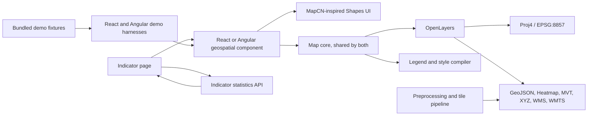
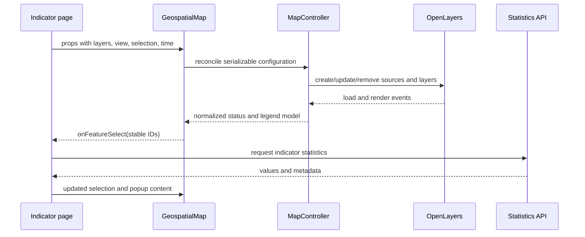

# Geospatial Map Component — Technical Architecture

Status: proposed implementation baseline

Related requirements: [`requirements.md`](./requirements.md)

## 1. Architecture decisions

| Area                  | Decision                                                                                                                                                                                                                  |
| --------------------- | ------------------------------------------------------------------------------------------------------------------------------------------------------------------------------------------------------------------------- |
| Application framework | React or Angular with TypeScript: one folder per framework, sharing the engine files                                                                                                                                      |
| Map engine            | OpenLayers                                                                                                                                                                                                                |
| Projection support    | Standard Equal Earth, ArcGIS Equal Earth (11° central meridian), and built-in Web Mercator                                                                                                                                |
| UI system             | Composable map parts built on product-owned Shapes primitives (`shapes.tsx`, `shapes.ts`), shadcn-style CSS tokens                                                                                                        |
| Packaging             | Two copy-paste source folders (shadcn-style, no build), React and Angular, plus a demo for each                                                                                                                           |
| Public API            | Declarative, serializable layer/style/legend configuration and typed events                                                                                                                                               |
| Map engine boundary   | OpenLayers classes remain private to the map package                                                                                                                                                                      |
| Basemaps              | Esri's World Basemap by default (Web Mercator vector tiles, reprojected to Equal Earth in the browser), with the bundled vector outlines as its fallback; ArcGIS vector basemaps by URL; raster tile basemaps in Mercator |
| Data preparation      | Geometry matching, repair, simplification, and tile generation happen before browser delivery                                                                                                                             |
| Demo strategy         | Static, deterministic fixtures first; optional network sources are clearly marked and never required to see a map                                                                                                         |
| Testing               | Unit tests for pure configuration logic and browser tests for visible rendering and interaction                                                                                                                           |

### 1.1 MapCN and Shapes integration

“Shapes” is treated as the product's UI component system (React components, or Angular directives and components). Map controls follow the composable, product-owned approach documented by [MapCN](https://www.mapcn.dev/docs): compact floating surfaces, shadcn-style design tokens, Lucide icons, accessible labels, and responsive popover/drawer behavior.

MapCN's map primitives use MapLibre GL, so they are not imported as the rendering engine: replacing OpenLayers would remove the required Equal Earth projection and conflict with the source architecture below. Instead, each folder owns the equivalent Shapes controls (React or Angular) and MapCN-inspired styling while OpenLayers renders geographic content only. Small legend samples use accessible inline SVG or CSS because they represent map symbols rather than general interface controls.

## 2. Design principles

1. **One canonical map state.** Store center in longitude/latitude and zoom independently of the active projection.
2. **Configuration in, events out.** Applications provide serializable configuration; the component emits stable, application-level events.
3. **No application networking in the renderer.** The host retrieves indicator statistics and updates props after a selection event.
4. **Style and legend share one model.** Classification is calculated once and drives both rendered symbols and the legend.
5. **Basemaps declare projection compatibility.** The component never silently shows a geometrically invalid source.
6. **Static demo data is the baseline.** The component must remain visible when optional third-party services are unavailable.
7. **Add scale only when measured.** Begin with GeoJSON for small fixtures and add vector tiles or workers where performance fixtures justify them.

## 3. System context



The indicator page owns filters, URLs, data permissions, and retrieved statistics. The map owns rendering, view state, geographic hit detection, layer state, legends, and map-specific controls.

## 4. Repository shape

Use a small pnpm workspace. The component is delivered as a **copy-paste source folder** in the style of shadcn/ui, one per framework: React teams copy `packages/geospatial-map/src`, Angular teams copy `packages/geospatial-map-angular/src`, and each team owns its copy from then on. A folder has no build step and no path aliases, and it imports nothing from outside itself.

The framework-neutral files (the OpenLayers engine, the configuration, the types, the bridge, the stylesheet) have one source, `packages/geospatial-map-core/src`. `pnpm sync-core` copies them, byte for byte, into both folders as committed files, so a team copies one folder and gets everything. `pnpm test` fails when a copy differs from the core.

```text
/
├── AGENTS.md, CLAUDE.md           instructions for agents working on this repository
├── .github/workflows/docs-site.yml  builds the docs site and publishes it to GitHub Pages
├── apps/
│   ├── demo/                      React demo (Vite); imports the folder as @/components/geospatial-map
│   │   ├── src/App.tsx            the harness, rendering the shared scenarios with React parts
│   │   ├── src/*Scenario.tsx      the scenarios with a component of their own
│   │   └── vite.config.ts         the two aliases; serves demo-shared/public next to the page
│   ├── demo-angular/              Angular demo (Angular CLI 21, zoneless); the same alias and routes
│   │   ├── src/app/app.ts         the harness, a port of App.tsx with the same labels and test ids
│   │   ├── src/app/scenarios/     the scenarios with a component of their own
│   │   ├── src/main.ts            zoneless, or zone.js with `?zone` or the `zone` configuration
│   │   ├── angular.json           styles, bundle budgets, the `zone` build and serve configurations
│   │   └── scripts/sync-public.mjs  copies demo-shared/public into public/ (gitignored) first
│   ├── demo-shared/               shared by the React and Angular demos; no framework code
│   │   ├── src/scenarios.ts       scenario ids and URL parameters (`?scenario=`, `?points=`, …)
│   │   ├── src/fixtures.ts        layer fixtures, map and grid configs, options, event log text
│   │   ├── src/demo-config.ts     demo layers, basemaps and zoom targets (src/world.ts: data)
│   │   ├── styles/                app.css (harness) and themes/ (Material, Carbon, editorial)
│   │   ├── public/data/           raster fixtures, loaded by relative URL (data/…)
│   │   └── typecheck/             the shared exports the shared code may import
│   └── site/                      the docs site (Astro, Starlight): both folders' guides, the
│       │                          examples with the demos embedded, and the demos (section 20.6)
│       ├── site.config.mjs        the repository, branch, origin and base every URL comes from
│       ├── src/guides/            the pages made from each folder's Markdown (catalog.mjs: order)
│       ├── src/data/examples.mjs  the examples, one per demo scenario
│       └── scripts/build.mjs      astro build, then both demos into dist/demo/
├── packages/
│   ├── geospatial-map-core/       the source of the shared files (never copied by teams)
│   │   ├── src/                   core/, config/, types.ts, map-bridges.ts, map-state.ts, messages.ts,
│   │   │                          theme.ts, basemaps.ts, world-data.ts, utils.ts, testing.ts, version.ts,
│   │   │                          geospatial-map.css and three framework-neutral examples
│   │   └── test/                  their unit tests, the styling contract and the sync guard
│   ├── geospatial-map/            the React folder (private workspace package, not published)
│   │   ├── src/                   ← the folder React apps copy
│   │   │   ├── README.md          install, composition, styling
│   │   │   ├── geospatial-map.tsx preset layout (<GeospatialMap>)
│   │   │   ├── map-root.tsx       <MapRoot>: frame, viewport, context
│   │   │   ├── use-map-engine.ts  controller lifecycle, state, open panel
│   │   │   ├── map-context.ts     useMap(), useMapRuntime(), useMapStatic(), useMapActions()
│   │   │   ├── map-controls.tsx … map-attribution.tsx   composable parts
│   │   │   ├── map-grid.tsx
│   │   │   ├── shapes.tsx         UI primitives (swap point for the design system)
│   │   │   ├── icons.ts           icon swap point (lucide-react)
│   │   │   ├── component-types.ts the React types: props, slots, icons, context values
│   │   │   ├── docs/  examples/   guides and type-checked task examples, copied with the folder
│   │   │   ├── AGENTS.md          instructions for coding agents in the receiving app
│   │   │   └── (synced)           the shared files from geospatial-map-core/src
│   │   └── test/                  SSR, portability, guides, consumer-compile
│   └── geospatial-map-angular/    the Angular folder (private workspace package, not published)
│       ├── src/                   ← the folder Angular apps copy
│       │   ├── README.md  AGENTS.md  CLAUDE.md  CHANGELOG.md  docs/  examples/
│       │   ├── index.ts           every public export, and GEO_MAP_PARTS
│       │   ├── geospatial-map.ts  preset layout (<geo-map>); map-grid.ts (<geo-map-grid>)
│       │   ├── map-root.ts        <geo-map-root>, and MapRootBase: the inputs and outputs it shares
│       │   │                      with <geo-map>
│       │   ├── map-engine.ts      the engine on signals (with arcgis-config.ts and world-fit.ts)
│       │   ├── map-context.ts     MAP_CONTEXT and the inject*() functions
│       │   ├── signals.ts  map-anchor.ts  map-templates.ts  map-action-event.ts   helpers
│       │   ├── map-controls.ts … map-attribution.ts   composable parts
│       │   ├── shapes.ts          UI primitives as directives and components
│       │   ├── icons.ts  map-icon.ts   lucide node icons, provideMapIcons(), <geo-map-icon>
│       │   ├── component-types.ts the Angular types: icons, template contexts, output payloads
│       │   └── (synced)           the same shared files as the React folder
│       ├── test/                  unit, SSR, hydration, exports, portability, guides;
│       │                          consumer-v21/ and consumer-v22/ for the paste test
│       ├── CONTRIBUTING.md        how to build a part, the known differences from React
│       └── vitest.config.ts       the Angular Vitest project (Analog plugin, jsdom, zoneless TestBed)
├── tests/
│   ├── browser/                   one Playwright suite run against both demos; parity/ and zone/
│   ├── testing-framework.md
│   └── requirements-matrix.md
├── scripts/                       sync-core.mjs  update-geospatial-map.mjs  write-schema.mjs
│                                  build-world-data.mjs  paste-test.mjs  angular-architect-build.mjs
│                                  playwright.mjs
├── playwright.config.ts           React, Angular, Angular with zone.js, and parity projects
├── vitest.config.ts               one `pnpm test`: the core and React project, the Angular one, the site's
├── package.json
├── pnpm-workspace.yaml
└── tsconfig.base.json
```

Each folder is one distributable unit, not separate core, framework, UI, legend, and export packages. Internal boundaries are kept by convention and by tests:

- `core/` and the other shared files never import React or Angular; a test in the core package checks their imports.
- Only `core/` imports OpenLayers.
- The parts reach the map only through the context and actions (`useMap*()` in React, `inject*()` in Angular). They share a few pure rules with `core/`, such as `canReorder` in `core/layer-order.ts`, so the layer panel and the map agree on which layers can move.
- Portability tests check, for each folder, that relative imports stay inside it, that the only bare imports are the declared dependencies, and that it compiles under a fresh app's strict TypeScript settings (a Vite or Next.js `tsconfig` for React; `ng new --strict` apps on Angular 21 and 22 for Angular).
- Both folders render the same elements, `geo-*` classes, `data-*` attributes, roles and labels. The browser suite runs against both demos, and its `parity` project compares their DOM.

Three `core/` files hold rules that several parts of the engine share:

- `core/time.ts`: how a layer follows the time frame (its URL, a WMS parameter, or a feature property) and which frames it has. Validation uses it too.
- `core/symbols.ts`: which symbol draws a feature, its size at the current zoom, its colours and point shape. The canvas renderer, the GPU renderer and the SVG export all use it.
- `core/layer-order.ts`: `canReorder`, used by the layer panel and the map.

## 5. Runtime architecture

### 5.1 React composition layer

`GeospatialMap` is the public component. It:

- Creates one `MapController` after the browser DOM target is mounted.
- Reconciles changed props without recreating unchanged sources or the map instance.
- Renders Shapes controls around the OpenLayers viewport.
- Converts controller events into typed React callbacks (`map-bridges.ts`). The controller acts first; the bridge then proposes the new state. A host controlling `state` answers with its next `state`, and when that differs from the proposal, the map is set back to the host's state.
- Destroys listeners, sources, observers, and the OpenLayers target on unmount.
- Uses `ResizeObserver` to call `map.updateSize()` when the container changes.

The React component must not directly build OpenLayers layers in render functions. That work belongs to `MapController`, which allows lifecycle behavior to be tested without coupling it to React re-renders.

### 5.2 Angular composition layer

The Angular folder is the same map for Angular 21 and 22: standalone components, `OnPush`, signal inputs and outputs, zoneless by default. It shares the engine files with the React folder and rewrites only the layer between them and the page. `<geo-map>` (`GeospatialMap`) is the preset, `<geo-map-root>` (`MapRoot`) the root for custom layouts; both extend `MapRootBase`, which holds the inputs, outputs and host bindings they share.

**The engine on signals.** `createMapEngine()` in `map-engine.ts` is the port of `use-map-engine.ts`. It drives the same `map-bridges.ts` and `MapController` as React; only the reactive primitives differ:

| React (`use-map-engine.ts` and its helpers)      | Angular (`map-engine.ts`, `arcgis-config.ts`, `world-fit.ts`)                                                                        |
| ------------------------------------------------ | ------------------------------------------------------------------------------------------------------------------------------------ |
| Config kept by content (`fingerprint`)           | A `computed` whose `equal` compares fingerprints: a config rebuilt with the same content keeps the old object, so nothing re-runs    |
| `useMemo` (validation, ui, messages, layers)     | `computed`                                                                                                                           |
| `useResettableState` (own state, own open panel) | `linkedSignal`: it starts over when the configured starting state or the panel defaults change                                       |
| The effect that creates the controller           | `afterRenderEffect` keyed on the viewport, the interactions and the projection; its cleanup undoes `onOpenLayersMap` and destroys it |
| The effect that commits config and state         | `afterRenderEffect` that reads the config, layers, state, map id and a proposals counter, so a host that refuses a state wins        |
| `useWorldFit` (layout effect)                    | `afterRenderEffect({ earlyRead })`, which measures the map before the first controller exists                                        |
| `useArcgisConfig`                                | Signals and a cancellable promise, read after render; not `resource()`, which was experimental in Angular 21                         |
| `useSyncExternalStore` runtime store             | The runtime is a `computed`; `injectMapRuntime(select)` is a `computed` of one slice, so a part updates only when its slice changes  |
| `forwardRef` + `useImperativeHandle`             | `exportAs: 'geoMap'` and a readonly `actions` on the root and the preset (`#map="geoMap"`, `viewChild.required(GeospatialMap)`)      |

**`MAP_CONTEXT` and the parts.** The root provides the `MAP_CONTEXT` token: a `staticValue` signal (config, resolved `ui`, messages, actions, icons), a `runtime` signal and the stable `actions`. Parts read it only through `injectMapStatic()`, `injectMapRuntime(select)`, `injectMapActions()`, `injectMapIcons()`, `injectMap()`, `injectMapPixel()`, `injectHoveredFeature()` and `injectSlotContext()`, never by injecting the root class, so a unit test can provide a fake context. Each part is a port of its React part and renders the same elements, `geo-*` classes, `data-*` attributes, roles and labels:

- The host element is the part's root. When the React root is a `div`, `section`, `footer` or `nav`, the part is an element (`<geo-map-legend>`; the breadcrumbs carry `role="navigation"` for React's `<nav>`); when it is a `button`, `label` or `svg`, it is an attribute on that element (`<button geoMapZoomIn>`, `<label geoMapBasemapField>`, `<svg geoMapLegendSymbol>`).
- A part React renders as `null` keeps its host, with no classes or ARIA attributes, hidden by `display: none` in its host style.
- A behaviour input is `undefined` by default and falls back to the `config.ui` value, like React's `prop ?? ui.x`.
- Built-in buttons emit a cancellable `MapActionEvent` through `(beforeAction)` before their action; React's equivalent is an `onClick` that calls `preventDefault()`.
- `<geo-map>` lays out every part in the order of React's `GeospatialMapLayout`, each behind `@if (ui.<part>.enabled)`. `GEO_MAP_PARTS` lists every part, template and shape for a component's `imports`.

**Templates.** React's render functions and slots become `ng-template` directives with typed contexts (`ngTemplateContextGuard`): `geoMapPopup`, `geoMapTooltip`, `geoMapControl="custom:…"`, `geoMapError` and `geoMapConfigError` (`map-templates.ts`). A part reads its own template with `contentChild()` and also takes a `template` input, which `<geo-map>` uses to forward the templates written inside it. React's `header` and `footer` props become projected `[geoMapPanelHeader]` and `[geoMapPanelFooter]` content, with the default header as `ng-content` fallback.

**Shapes.** `shapes.ts` is the design-system swap point, as in React. `ShapeCard` and `ShapeAlert` are directives the parts apply to their own host through `hostDirectives`; `button[geoShapeButton]`, `button[geoShapeIconButton]`, `<geo-shape-select>`, `input[type=range][geoShapeSlider]`, `label[geoShapeSwitch]`, `[geoShapeLabel]` and `[geoShapeBadge]` appear in the parts' templates. A team replaces the bodies (for example `hostDirectives: [HlmButton]`, or a `<mat-select>` template) and keeps the names, selectors, inputs and outputs.

**Icons.** The default icons come from `lucide`, the framework-neutral package, as SVG node lists. A `MapIcon` is a node list (`MapSvgIcon`) or any icon component. `<geo-map-icon>` (`display: contents`) draws a node list into an `svg[geoIcon]` with `Renderer2`, never `innerHTML`, and a component with `NgComponentOutlet`. A node list may start with `['svg', attributes]` to set the svg's own attributes, so filled sets on another view box work as node lists. Icons are set in `icons.ts` (every map), with `provideMapIcons()` (an app or a route), or with `[icons]` (one map).

**Zones.** Nothing depends on zone.js. OpenLayers is created and driven inside `NgZone.runOutsideAngular`, which is a no-op without zone.js, and so are the actions, the playback timer and the overlay observers. Map events reach the page only by writing signals and emitting outputs: no `ChangeDetectorRef`, no `NgZone.run`, no RxJS. Actions that return a promise keep the caller's zone, so the caller's `then` updates the view in a zone-based app.

**Server rendering and hydration.** On the server, the root and the parts render the accessible shell (the map element, the parts and their labels). OpenLayers, `ResizeObserver`, `matchMedia`, geolocation, fullscreen and the ArcGIS service reads run only in `afterNextRender`, `afterRenderEffect` or event handlers, so they never run on the server. With hydration, the browser takes over the server's DOM; `svg[geoIcon]`, the one part that adds nodes with `Renderer2`, replaces the server's nodes instead of drawing a second set. OpenLayers adds its own DOM after hydration, so no part needs `ngSkipHydration`.

### 5.3 Map core

`MapController` owns exactly one OpenLayers `Map` and exposes application-level commands:

```ts
type MapController = {
  update(options: MapControllerOptions, resync?: boolean): void
  setView(view: Partial<MapViewState>, origin?: MapOrigin): void
  setBasemap(id: string): boolean
  setSelection(selection: MapSelection | null): void
  setTime(time: string | null, origin?: MapOrigin): void
  fit(target: FitTarget, options?: FitOptions): void
  exportImage(options: ExportOptions): Promise<Blob>
  destroy(): void
}
```

Each map has one projection. The controller creates its OpenLayers view once, in the projection of `initialState.view.projection` (or an ArcGIS basemap's own), and keeps it for its whole life. A config with another projection, or other interactions, builds a new controller.

`update()` applies new options from the engine (React's or Angular's). Layers are added and removed in place, so layers the host added through `onOpenLayersMap` and listeners on the layer collection survive a change of the configured layers. With `resync`, the host answered a proposed state with another one, and the controller sets the map back to the host's state. `destroy()` disposes the OpenLayers map.

The controller contains the minimum state required to reconcile OpenLayers objects:

- Canonical view state.
- Layer registry keyed by stable layer ID.
- Active basemap ID.
- Active selection.
- Current time.
- In-flight source state and errors.
- Compiled style and legend models.

The controller does not store host popup content, fetched statistics, application filters, or authentication state.

### 5.4 UI component tree

`MapRoot` owns the controller, state, the open panel, and context; every visible piece is a separate part. The `GeospatialMap` preset renders the parts below in this order, each enabled by `config.ui`. Host applications can instead compose any subset inside `MapRoot`, or add their own parts that use `useMap()` (React) or `injectMap()` (Angular). The Angular parts have the same class names, with `geo-map-*` element selectors or `geoMap*` attribute selectors (section 5.2).

```text
MapRoot                       section.geo-map-root > div.geo-map-stage > div.geo-map-viewport (OpenLayers)
├── MapControls               MapCN-style grouped icon controls
│   └── MapControlGroup
│       ├── MapZoomInButton / MapZoomOutButton / MapResetZoomButton
│       ├── MapLocateButton
│       ├── MapLayersButton
│       ├── MapFitButton
│       ├── MapSettingsButton
│       ├── MapFullscreenButton
│       └── MapControlButton  host-defined controls
├── MapSettings               basemap (in the map's projection), area and export fields
├── MapBreadcrumbs            optional path of zoom targets (ui.breadcrumbs.targets)
├── MapLayerPanel             visibility, opacity, order, status, under group headings
├── MapLegend                 MapLegendSymbol per entry
├── MapPopup                  optional, host content
├── MapStatusChips            loading / no-data chips
├── MapTimeControls           optional
├── MapErrorAlert             recoverable errors
└── MapAttribution
```

The CSS is token-based (`--geo-*`, shadcn naming, light and dark), and every rule has single-class specificity, so host stylesheets override it without `!important`. The OpenLayers canvas (labels, selection) and exported reports read the same tokens at runtime.

### 5.5 Shapes component mapping

| Map UI                        | Shapes component                                                   |
| ----------------------------- | ------------------------------------------------------------------ |
| Zoom, reset zoom, locate, fit | Grouped icon `Button` with tooltip and accessible name             |
| Basemap                       | `Select`                                                           |
| Layer visibility              | `Switch` or `Checkbox`                                             |
| Layer ordering                | Small up/down `Button` controls initially                          |
| Layer settings                | `Sheet` on narrow screens, `Popover` or side panel on wide screens |
| Legend container              | `Card`, optional `Accordion` for multiple layers                   |
| Time selection                | `Slider` plus labeled value                                        |
| Export actions                | `DropdownMenu`                                                     |
| Feature details               | `Popover` on desktop and `Sheet` on narrow screens                 |
| Loading                       | `Skeleton` and non-blocking status text                            |
| Source failure                | `Alert` scoped to the failed layer                                 |
| Zoom-target path              | `Breadcrumb`                                                       |

Initial layer reordering uses explicit up/down buttons. Drag-and-drop can be added after user testing demonstrates a need; it is not needed to satisfy ordering or keyboard accessibility.

## 6. Public React API

```ts
export type ProjectionId = 'EPSG:8857' | 'EPSG:3857' | (string & {}) // e.g. 'ESRI:EQUAL-EARTH-CM11'

export type MapViewState = {
  center: [longitude: number, latitude: number]
  zoom: number
  projection: ProjectionId
  rotation?: number
}

export type MapSelection = {
  layerId: string
  featureId: string
}

export type MapRootProps = MapCallbacks &
  HTMLAttributes<HTMLElement> & {
    config: MapConfigInput
    state?: MapState
    onStateChange?: (state: MapState, change: MapStateChange) => void
    openPanel?: MapPanelId | null
    onOpenPanelChange?: (panel: MapPanelId | null) => void
    children?: ReactNode // composable parts
  }

export type GeospatialMapProps = MapRootProps & {
  slots?: MapSlots // preset only
}
```

`<MapRoot>` provides the map to its children through context (`useMap()`, `useMapRuntime(select)`,
`useMapStatic()`, `useMapActions()`). `<GeospatialMap>` is the preset that composes every part from
`config.ui` and `slots`; it suits most maps, and `<MapRoot>` with parts suits custom layouts.

`config` is a strict versioned JSON contract. Controlled `state` wins when supplied: the map
proposes each change through `onStateChange`, and when the host keeps another state, the map is
set back to it. Otherwise, the component owns state from `config.initialState`. Each change
carries a `MapOrigin`: `'user'` (someone used the map), `'api'` (a `MapActions` call, from host
code or a built-in control), or `'state'` (the starting state or a new `state` prop). The open
panel (`'layers' | 'settings' | null`) is held by the root the same way, controlled with
`openPanel` and `onOpenPanelChange`. Profile defaults are resolved before config overrides,
nested objects merge, and arrays replace. Runtime callbacks and React slots remain outside JSON
configuration.

The contract is one TypeBox schema in `config/schema.ts`, checked against the TypeScript types at
compile time (`schema-types.test-d.ts`). `pnpm schema` writes the same in-memory objects to
`map-config.schema.json` (`mapConfigSchema`, the complete config) and `map-config-input.schema.json`
(`mapInputSchema`, the short form), so the runtime and distributed schemas cannot drift.

Validation lives in one place. `config/validate.ts` holds every rule: the schema plus the
semantic cross-field rules, and the messages for fields renamed or removed in earlier releases
(`config/legacy.ts`). `validateMapConfig` reports all issues. The renderer checks the same rules
before it builds layers, for configs that skipped `validateMapConfig`; `core/validation.ts`
throws the first issue.

### 6.1 Imperative access

The ref is `MapActions`, the same object as `useMapActions()` and the slots' `actions`:

```ts
export type GeospatialMapHandle = MapActions // excerpt:
// fit(target: FitTarget, options?: FitOptions): void
// fitSelection(options?: FitOptions): boolean
// select(selection: MapSelection | null): void
// setLayerVisibility(layerId: string, visible: boolean): void
// setOpenPanel(panel: MapPanelId | null): void
// exportImage(options: ExportOptions): Promise<Blob>
// getState(): MapState
```

A command proposes state like a user change, with origin `'api'`, so controlled hosts see it
through `onStateChange`. `getState()` returns the view as the map shows it now, also during an
animation. There is no projection command: the projection is part of the config.

### 6.2 The same API in Angular

The Angular folder has the same configuration, state, events and actions, in Angular's form (section 5.2):

- `config` is an input; `[(state)]` and `[(openPanel)]` are two-way bindings. `(stateChange)` emits the state and `(stateChangeDetails)` emits `{ state, change }`.
- Callbacks are outputs without the `on`: `(featureSelect)`, `(viewChange)`, `(ready)`, … React's `onError` is `(mapError)`, because `error` is a DOM event name. `loadGeoJson` and `onOpenLayersMap` are function inputs.
- Hooks are `inject*()` functions (`useMapRuntime` is `injectMapRuntime`). The `ref` is the root's `actions` field: `#map="geoMap"` in a template, `viewChild.required(GeospatialMap)().actions` in a class.
- Slots are `ng-template`s (`geoMapPopup`, `geoMapTooltip`, `geoMapControl`), and `renderConfigError` is a `geoMapConfigError` template.

Both roots accept `MapHostInputs` from the shared `types.ts` (`MapCallbacks` plus `state`, `onStateChange`, `openPanel`, `onOpenPanelChange`, `loadGeoJson` and `onOpenLayersMap`), which `map-bridges.ts` reads. Each folder's own types are in its `component-types.ts`. The full list is in the Angular folder's `README.md` and `docs/state-events-templates.md`.

## 7. Layer and source contracts

All public configurations are JSON-serializable except render callbacks and templates (React slots, Angular `ng-template`s).

```ts
type CommonLayerConfig = {
  id: string
  title: string
  visible?: boolean
  opacity?: number
  minZoom?: number
  maxZoom?: number
  reorderable?: boolean
  required?: boolean
  showInLayerControl?: boolean
  group?: string
  exclusiveGroup?: string
  attribution?: AttributionSpec[]
  legend?: LegendSpec
  exportable?: boolean
}

// GeoJSON and vector tile (mvt) layers only.
type SelectableLayerConfig = {
  selectable?: boolean
  featureIdField?: string
  propertyAllowlist?: string[]
}

// GeoJSON, heatmap, mvt, xyz and wms layers.
type TimedLayerConfig = { time?: LayerTimeSpec }

export type MapLayerConfig =
  | GeoJsonLayerConfig // Common & Selectable & Timed
  | HeatmapLayerConfig // Common & Timed
  | VectorTileLayerConfig // Common & Selectable & Timed
  | XyzLayerConfig // Common & Timed
  | WmsLayerConfig // Common & Timed
  | WmtsLayerConfig // Common
  | ArcGISVectorTileLayerConfig // Common
```

Layers draw in list order (and in the order of `state.layers[id].order`); there is no `zIndex`. The layer panel lists layers under their `group` heading. When several selectable features are under a click, the top-most one is selected. Basemap layers (`BasemapLayerConfig`) may also set `aboveOverlays` to draw labels or borders above the data.

### 7.1 GeoJSON source

```ts
type GeoJsonLayerConfig = {
  kind: 'geojson'
  data: GeoJSON.FeatureCollection | { url: string }
  dataProjection?: 'EPSG:4326' | string
  style: ThematicStyleSpec
}
```

### 7.2 Heatmap source

`HeatmapLayerConfig` reuses the GeoJSON loader and adds JSON-safe weight, gradient, radius, blur, and zoom-stop fields. OpenLayers' WebGL heatmap remains private to the renderer. Heatmaps are aggregate and non-selectable; PNG/JPEG preserve the rendered canvas and SVG uses the labeled raster wrapper.

The documented default source CRS is `EPSG:4326`. A source with another CRS must declare it. Inline data is appropriate for tests and small fixtures; URL data is appropriate for cacheable static assets.

### 7.3 Vector-tile source

```ts
type VectorTileLayerConfig = {
  kind: 'mvt'
  urlTemplate: string
  sourceProjection: string
  sourceLayer?: string
  maxSourceZoom?: number
  style: ThematicStyleSpec
}
```

MVT is the preferred browser delivery for detailed Admin 1/Admin 2 geometry and dense global data. Tile generation is external to the component.

### 7.4 Raster sources

```ts
type XyzLayerConfig = {
  kind: 'xyz'
  urlTemplate: string
  sourceProjection: string
  crossOrigin?: 'anonymous'
}

type WmsLayerConfig = {
  kind: 'wms'
  url: string
  params: Record<string, string | number | boolean>
  sourceProjection: string
  tiled?: boolean
}

type WmtsLayerConfig = {
  kind: 'wmts'
  url: string
  layer: string
  matrixSet: string
  format: string
  sourceProjection: string
  tileGrid: WmtsTileGridSpec
}
```

Raster layers declare whether browser export is permitted and whether the source sends compatible CORS headers. Client-side reprojection is allowed but should not be the default for high-volume or high-detail production rasters.

### 7.5 Runtime validation

TypeScript protects code authored in the same build but does not validate server JSON. The host validates externally loaded configs at the trust boundary with `validateMapConfig`, which reports every issue with its field path. Every rule lives in `config/validate.ts`: the TypeBox schema, the cross-field rules (for example, an XYZ layer with `time` must have `{time}` in its URL), and the messages for renamed or removed fields. The renderer runs the same rules before it builds layers (`core/validation.ts`) and reports the first problem as a `CONFIG_INVALID` error with the layer ID.

## 8. Data lifecycle



### 8.1 Reconciliation rules

- Stable layer IDs are mandatory.
- Unchanged source identity preserves its OpenLayers source and cache.
- Style-only changes update style functions without recreating source data.
- Visibility, opacity, and order update existing layer properties.
- A changed URL, source projection, format, or tile grid replaces the source.
- Removed layers release listeners and references, and nothing is drawn for them after removal.
- New view/filter/time changes supersede obsolete asynchronous requests. A layer that loads data for each frame shows only the latest load.
- Layers are added and removed in place; layers the host added through `onOpenLayersMap` are kept.
- A layer that can't be built leaves the map as it was and reports the error.

Each built layer (`BuiltLayer`) has one hook for map changes: `update(change)`, with `change` one of `'zoom'`, `'time'`, `'selection'`, or `'theme'`. The controller calls it on every built layer when that part of the map changes, and the layer redraws what depends on it.

## 9. Projection architecture

### 9.1 Registration

Register Equal Earth once before creating a view:

```ts
proj4.defs('EPSG:8857', '+proj=eqearth +lon_0=0 +datum=WGS84 +units=m +no_defs +type=crs')
register(proj4)
```

The registered OpenLayers projection receives global/world extents appropriate to Equal Earth and `setGlobal(true)`. Web Mercator is provided by OpenLayers.

The ArcGIS Equal Earth vector basemap is registered separately as `ESRI:EQUAL-EARTH-CM11` because its service definition uses an 11° central meridian. It renders in that native projection to avoid global-edge artifacts; it must not be mislabeled as standard `EPSG:8857`.

### 9.2 Canonical state

The public state always stores:

- Center as `[longitude, latitude]` in WGS 84.
- Canonical zoom, independent of OpenLayers resolution arrays.
- Rotation in radians.
- Active projection ID.

The projection is part of the view state so that hosts can read it, but it doesn't change while the map runs.

### 9.3 One projection per map

Each map has one projection, chosen in its config: `initialState.view.projection`, or an ArcGIS basemap's own. There is no projection switching, no projection command, and no projection event. The controller creates the OpenLayers `View` in that projection once. A config that names another projection builds a new map, since OpenLayers can't change the projection of an existing view.

Pages that need Equal Earth for the world and Web Mercator for local detail render two maps, or choose the projection when they build the config.

### 9.4 Dateline behavior

Global polygon data must be cut or normalized at the antimeridian during preprocessing. The renderer sets intentional `wrapX` behavior per source. Coarse polygons that cross the dateline must not be patched ad hoc in the browser because the same defect will recur at each LOD and projection.

## 10. Basemap architecture

### 10.1 Basemap contract

```ts
export type BasemapConfig = {
  id: string
  title: string
  supportedProjections: ProjectionId[]
  layers: BasemapLayerConfig[] // MapLayerConfig & { aboveOverlays?: boolean }
  backgroundColor?: string
  attribution?: AttributionSpec[]
  exportable?: boolean
  fallbackBasemapId?: string // another basemap of the list, shown when this one can't be loaded
}
```

A basemap is a named group of non-selectable layers at the bottom of the layer stack; layers with `aboveOverlays` draw above the data (labels, borders). Only one basemap is active at a time. Your layers remain unchanged when the basemap changes, and switching it emits no layer events.

### 10.2 Demo basemap catalog

| ID                      | Projection               | Source                                                                                             | Purpose                                                                                           |
| ----------------------- | ------------------------ | -------------------------------------------------------------------------------------------------- | ------------------------------------------------------------------------------------------------- |
| `esri-world`            | `EPSG:8857`, `EPSG:3857` | Esri's World Basemap v2 (`esriWorldBasemap`), Web Mercator vector tiles from `basemaps.arcgis.com` | The component's default; the harness's Equal Earth start, falling back to `reference-equal-earth` |
| `reference-equal-earth` | `EPSG:8857`              | Bundled simplified Admin 0 GeoJSON in `EPSG:4326`, optional bundled label points                   | Reliable global Equal Earth view                                                                  |
| `reference-mercator`    | `EPSG:3857`              | The same bundled reference geometry, rendered in Mercator                                          | Offline/export-safe Mercator comparison                                                           |
| `osm-mercator`          | `EPSG:3857`              | OpenStreetMap XYZ tiles                                                                            | Familiar street/context view for local interaction                                                |

The two reference basemaps intentionally share one small source fixture while defining projection-specific view defaults and styles. Water is the map background; land, coastlines, boundaries, and optional labels are vector layers.

### 10.3 Basemaps and the map's projection

- At start, the map uses the requested basemap if it supports the map's projection, and otherwise the first configured basemap that does.
- The basemap picker lists only basemaps that support the map's projection.
- `setBasemap` refuses a basemap that doesn't support it and reports `BASEMAP_INCOMPATIBLE`.
- A configuration without basemaps gets `[esriWorldBasemap, worldBasemap]` (`config/normalize.ts`): it starts on the Esri basemap, in Equal Earth.
- In the demo, the Equal Earth map starts on `esri-world`, and `?projection=EPSG:3857` starts the map in Mercator with `reference-mercator`.

### 10.4 Why Equal Earth uses vector basemaps

OpenLayers can reproject Web Mercator raster tiles to Equal Earth, which is useful for compatible overlays and diagnostics. No raster basemap is reprojected by default: resampled images blur, show reprojection artifacts at some scales, complicate export, and keep map content designed for Mercator. Vector tiles are different: their features are transformed and drawn again in the map's projection, so lines and labels stay sharp. The default Equal Earth basemap is therefore Esri's World Basemap as vector tiles (10.5), and its fallback is the small bundled vector outlines, which are predictable, cacheable, projection-correct, and need no network.

The bundled demo fixture is not automatically approved for official publication. Production applications replace it with a preprocessed approved boundary source and retain that source's attribution, version, and boundary policy. The same holds for Esri's World Basemap: its boundaries and names are Esri's, under Esri's terms of use, and its attribution (the service's copyright text) is shown with it.

### 10.5 Reprojected vector tile basemaps

`arcgisBasemap({ url, projections })` declares the projections a basemap is drawn in; without `projections`, they are read from the service. `resolveArcgisConfig` (`core/arcgis.ts`) turns each ArcGIS layer into an `mvt` layer that keeps the service's projection and tile grid whatever the map's. When the two differ, `buildVectorTileLayer` gives the layer a source in the map's projection whose tiles it puts together from the service's (`reprojectedTileSource`, `core/layers/vector-tile-layer.ts`), and `core/projections.ts` provides the transforms. They handle what a plain reprojection gets wrong:

- **Tiles of the map, put together.** Each 256-pixel tile of the map's own grid is made of the service tiles it covers, chosen as OpenLayers would choose them (by resolution, up to `maxSourceZoom`). OpenLayers can reproject a vector tile source itself, and 0.11.0 let it, but it draws each tile of the map service tile by service tile, all the style layers of one before the next: where two service tiles overlap along a curve, the later one's lower layers (the shallow sea under the deep sea) showed through its anti-aliased edge as a hairline. It also reprojected every vertex each time it drew a tile at a new zoom level, for each layer of the basemap, which held the map for seconds while zooming. One tile to OpenLayers per tile of the map is drawn style layer by style layer, with its features already in the map's projection.
- **Read once.** `OverlapFormat` reads a service tile when a tile of the map first needs it: it clips, densifies and transforms the features into the map's projection once, and the source keeps the last 256 service tiles read for the neighbouring tiles of the map. A point goes to the one tile of the map it falls in, so a label is placed once; lines and areas go to every tile within 100 pixels of them (OpenLayers' render buffer), so a wide stroke just past a tile's edge is still drawn into it. Whatever fails while a tile is put together (a service tile, reading it) fails the tile, so the map never waits on it.
- **No wrapped worlds.** `wrapX` is off for tiles drawn in another projection: tiles past the antimeridian would repeat the world beside the map's outline.
- **The edge of the world.** `registerReprojection` replaces the transforms between a world-wrapping tile projection (Web Mercator) and the view. Forward, points in the buffer of tiles at the antimeridian are put on the edge of the world instead of being moved by the width of the view, which in Equal Earth leaves slivers outside its curved outline. Backward, used to find the service tiles a tile of the map needs, the view's corners (outside its rounded outline) are moved onto it and its poles into the tiles' world (85° in Web Mercator), so each tile of the map needs only the service tiles it shows.
- **Each service tile draws only itself.** A tile of the map is a rectangle; the service tiles it is made of have curved sides there (the meridians between Web Mercator tiles, in Equal Earth). What a vector tile carries past its edges (a buffer cut along straight lines, 8 pixels of 512 on Esri's at most levels and up to 72 at levels 16 to 18, and at the antimeridian the other side of the world) would be drawn over its neighbours: twice where they draw it too (dashes and transparent fills darker), the cut edges of areas outlined, and place names copied onto the far edge of the world. `OverlapFormat` therefore clips lines and areas to the service tile (`reprojectableFeatures`, `clipRing`, `clipLine`) and leaves out points outside it.
- **No seams.** Two service tiles clipped along the line where they meet would leave a faint seam, so each reaches one pixel past its edges (`overlapping`, into its buffer), and `OverlapFormat` still places the features by the tile's own extent. Drawn one style layer at a time, the overlap doesn't show.
- **Curved edges.** Reprojection moves only the vertices of a feature, so a long straight edge stays straight: an area cut along a tile's side (a meridian, curved in Equal Earth) would leave slivers of land and water across the map where tiles meet. `densify` adds a vertex wherever a segment crosses a grid of 1/64 of the tile, so edges follow their curve, and edges along the same line get the same vertices and still coincide.
- **Outlines.** ol-mapbox-style outlines every filled area (in `fill-outline-color`, or its fill colour); `withoutCutOutlines` draws the fill whole and the outline only along the area's own edges (`areaOutline`), not along the cuts.
- **Style zoom levels.** For tiles drawn in another projection, `styleResolutions` continues the tile grid's resolutions past the service's last level and scales them to the map's units, so the style switches its zoom-dependent layers at about the scale it does in its own projection (for Web Mercator tiles in Equal Earth, within 0.02 zoom levels at the equator). Tiles drawn in their own projection keep the tile grid's resolutions, as before 0.11.
- **The last level with tiles.** ArcGIS services list zoom levels past the last one they have tiles for (Esri's World Basemap lists 22 and has tiles to 16, its `maxLOD`). `arcgisToMvt` sets `maxSourceZoom` to `maxLOD`, and the source reads no deeper level: it draws those from the last one, as ArcGIS's own maps do, instead of asking for tiles a service may answer with errors (which would switch the map to its fallback, 10.6). The tile grid keeps every listed level, which numbers the style's zoom levels. `lastSourceLevel` does the same for a source in its own projection, since OpenLayers ignores `maxZoom` when it is given a tile grid.

The limits are those of the tiles. Web Mercator tiles stop at about 85°, so in Equal Earth the polar caps show the basemap's background (`--geo-basemap-water`), not its sea. Near the poles a tile of the map covers more service tiles than at the equator, and deeper ones: the service level is chosen by resolution, as OpenLayers does, which keeps the style's zoom levels matched to the data but ignores that Web Mercator stretches the high latitudes (about one level deeper than Web Mercator at 60°, three at 78°: 94 tiles for a view of Svalbard that Web Mercator draws from 3). Choosing the level by the scale at the view's latitude would need the style's zoom levels to follow it, across the view. Only basemaps are reprojected: an ArcGIS vector tile layer in `data.layers` in another projection than the map's is a configuration error.

### 10.6 Basemap fallback

A basemap may name `fallbackBasemapId`, another basemap of the list; `validateMapConfig` rejects an unknown id or the basemap itself. `esriWorldBasemap` names `world`. The map switches at two stages, quietly: no error alert, no `onError` in React or `(mapError)` in Angular, no `data-layer-errors`, and one `[geospatial-map]` console hint per basemap.

- **Reading the service.** Both framework engines (React `use-arcgis-config.ts`, Angular `arcgis-config.ts`) read every ArcGIS service before the map starts, with a 10-second limit per request (`core/http.ts`). When a read fails, `arcgisFallback()` (`core/arcgis.ts`) drops the ArcGIS layers, removes each basemap made only of them that names a fallback (following fallbacks past other removed basemaps, to one that supports the map's projection), and makes its fallback the active basemap if it was. It returns no error when only such basemaps failed, and the usual `SOURCE_LOAD_FAILED` otherwise. It also returns the removed basemaps with their replacements (`replaced`), which the engine passes to the controller (`replacedBasemaps`): a host that controls the state and still names a removed basemap sees its replacement, and is told once through `onBasemapChange` (proposed as below); if it keeps the old id, the map stays on the replacement and does not ask again.
- **Drawing.** When a layer of the active basemap fails later (its style, or every tile of a load), `LayerRegistry` asks the controller to `recover` before it reports the error. `MapController` switches to the fallback when that supports the map's projection and hasn't failed itself, and calls `onBasemapChange`. `map-bridges.ts` proposes the new `activeBasemapId` with domain `basemap` and origin `api`, so owned and controlled state, the settings panel and `onStateChange` follow, as for `setBasemap`. A host state that still names the failed basemap keeps the fallback; a new state that asks for it again tries it again.

A style document may take 30 seconds (`STYLE_TIMEOUT_MS`); a vector tile layer with a style counts as loading until the style is applied, so a map whose style fails is not ready before the failure is known.

## 11. Symbology

### 11.1 Style model

The public style model is deliberately smaller than the complete OpenLayers style API:

```ts
type ThematicStyleSpec =
  | { type: 'constant'; symbol: SymbolSpec }
  | {
      type: 'categorical'
      field: string
      categories: Array<{ value: string | number | boolean; label: string; symbol: SymbolSpec }>
      fallback?: LegendClass
    }
  | {
      type: 'graduated'
      field: string
      classes: Array<{ min?: number; max?: number; label: string; symbol: SymbolSpec }>
      missing?: LegendClass
    }
  | {
      type: 'continuous'
      field: string
      domain: [number, number]
      stops: Array<{ value: number; color: string }>
      clamp?: boolean
      missing?: LegendClass
    }

type SymbolSpec = PointSymbol | LineSymbol | PolygonSymbol
```

`PointSymbol`, `LineSymbol`, and `PolygonSymbol` contain only the requested color, opacity, size, shape, width, dash, label, and zoom-scaling properties. They do not expose OpenLayers constructors.

### 11.2 Compilation

`compileThematicStyle(spec, metadata)` returns:

```ts
type CompiledStyle = {
  openLayersStyle: unknown
  legend: NormalizedLegend
  warnings: StyleWarning[]
}
```

Both outputs derive from the same normalized classes. A style change therefore cannot leave a stale legend. Compiled style objects are memoized by stable configuration identity; feature values are not copied into React state.

### 11.3 Zoom-dependent symbols

Symbol specifications choose one of two size modes:

- `screen`: size remains in CSS pixels while zooming.
- `scale`: size is interpolated between declared zoom stops.

Layers independently declare `minZoom` and `maxZoom`. Geometry LOD and feature density come from source selection or tiles, not from the symbol compiler.

## 12. Legend architecture

### 12.1 Legend contract

```ts
type LegendSpec = {
  title?: string
  subtitle?: string
  units?: string
  description?: string
  sourceNote?: string
  presentation?: 'list' | 'continuous-ramp' | 'size-ramp'
  entries?: LegendEntry[]
  showLayerToggle?: boolean
}

type LegendEntry = {
  id: string
  label: string
  symbol: SymbolSpec | { gradient: Array<{ value: number; color: string }> }
  value?: string | number | [number, number]
}
```

### 12.2 Generation rules

- `constant`, `categorical`, and `graduated` styles generate discrete entries.
- `continuous` styles generate a color ramp with min/max labels and optional intermediate ticks.
- Explicit legend text may override generated labels but not classification boundaries.
- Missing, suppressed, and not-applicable values receive separate entries when configured.
- Raster layers may supply a legend independently because their pixel styling can occur on a server.
- Hidden layers are omitted or shown disabled according to `showLayerToggle`.
- Entries are ordered exactly as the corresponding classification or server metadata.

### 12.3 Legend rendering

`MapLegend` receives normalized legend data, not OpenLayers layers. It uses Shapes `Card` and `Accordion` components and renders each mark with a small SVG:

- Circle, square, triangle, or configured point shape.
- Line sample with width and dash.
- Polygon sample with fill and stroke.
- Continuous SVG gradient.
- Proportional size sequence.

Every visual mark has adjacent text. The legend remains useful without color perception and is included in the export composition.

## 13. Interaction and indicator statistics

### 13.1 Hit detection

The controller performs OpenLayers hit detection against visible selectable layers (GeoJSON and vector tiles; heatmaps are never selectable) in descending display order. A configurable hit tolerance accommodates touch. The top-most feature under the click is selected. When several features are under it, the event lists the others as `candidates`, each with its layer's title, so the host can offer a choice.

```ts
type FeatureEvent = {
  mapId: string
  layerId: string
  featureId: string
  coordinate: [longitude: number, latitude: number]
  properties: Record<string, JsonValue>
  candidates?: FeatureCandidate[] // { layerId, featureId, title, properties }
}
```

Only allowlisted properties are emitted. Stable IDs come from `featureIdField`; display names are not used as identity.

### 13.2 Selection and highlighting

Selection is a separate rendering layer or overlay style keyed by `{layerId, featureId}`. It is not implemented by mutating source features. This preserves source data, survives style changes, and allows external filter selection to use the same path as map clicks.

Clicks and `actions.select()` take one path in `map-bridges.ts`: highlight, announce, propose the state, then call `onFeatureSelect`. `onFeatureSelect` is called only when the selection changes. A selection made from code reports its feature once the feature has loaded, never a `null` in the meantime.

### 13.3 Popup flow

1. User selects a feature.
2. The map emits stable geographic identifiers immediately.
3. The host shows loading popup content and requests statistics.
4. The host supplies success, no-data, or error content through typed slots (React) or templates (Angular).
5. Closing the popup asks the host to clear controlled selection.

The package never injects arbitrary feature HTML and never knows the indicator API URL.

### 13.4 Breadcrumbs and fit

`ZoomTarget` is `{ id, label, bounds, maxZoom? }`, with bounds in longitude/latitude. Breadcrumbs are host-configured data rendered by the map UI: `ui.breadcrumbs.targets` lists zoom target IDs, widest first. `fit()` transforms the WGS 84 extent into the active projection and applies padding, duration, and maximum zoom.

## 14. Time architecture

The host supplies the canonical timeline. Layers list their frames, and `core/time.ts` infers how a frame becomes source state from the layer itself:

```ts
type LayerTimeSpec = {
  values: string[]
  field?: string
}
```

- A URL with `{time}` (any kind with a URL; GeoJSON and heatmap `data.url`) is requested again for each frame.
- A WMS layer gets the frame as the request parameter named by `field` (default `TIME`).
- Otherwise (GeoJSON, heatmap, vector tiles), features are filtered by the property `field` (default `time`).

`time` is available on GeoJSON, heatmap, vector tile, XYZ, and WMS layers. While the map shows a frame a layer doesn't have, the layer is hidden and its status says `noData`. When layers have frames and the config sets no starting time, the map starts at the first frame.

`TimeControls` is a controlled Shapes UI. Playback is a small interval state machine owned by the framework layer (React state, or an Angular `effect` whose timer runs outside the zone). It advances only after required layers for the current frame are ready or a configured timeout is reported. GeoJSON and XYZ layers with `{time}` in their URL load the next frame ahead; a frame that failed is requested again the next time it is shown.

## 15. Map grid

`MapGrid` composes up to six ordinary `GeospatialMap` instances. It does not introduce a second renderer.

```ts
type MapGridProps = MapGridCallbacks & {
  config: MapGridConfig
  state?: MapGridState
  slots?: MapSlots
  onStateChange?: (state: MapGridState, mapId: string | null, change?: MapStateChange) => void
}

// Each MapCallbacks callback, with the map's id as an extra last argument:
// onViewChange(event, mapId), onError(error, mapId), …
type MapGridCallbacks = {
  [Name in keyof MapCallbacks]?: (
    ...args: [...Parameters<NonNullable<MapCallbacks[Name]>>, mapId: string]
  ) => void
}
```

Indicator, time, style, and layer metadata are shared through `config.shared`. Each cell has an
independent state by default. The grid has separate view, layer, time, and selection synchronization
policies and identifies the origin map in its unified state callback and in every `on*` callback.

The grid follows `config.maps`: maps can be added and removed. A changed grid config starts each
map's state over from its config. Only changes a user or an action made (origin `'user'` or
`'api'`) are synchronised to the other maps; the changes a map made to follow the grid
(origin `'state'`) are not passed on, so they don't echo back.

## 16. Export and embedding

### 16.1 Image export

The initial export path is client-side PNG/JPEG:

1. Wait for every visible layer to reach ready or error state. A failed `required` layer fails the export; another failed layer is exported without its data.
2. Render the map at the requested pixel dimensions (default report size 1200 × 720 report pixels), then put the map back at its screen size, even when the export failed.
3. Composite OpenLayers canvases using each canvas transform and opacity.
4. Draw report title, active time, selected area, legend, attribution, and source note.
5. Return a `Blob` without triggering a download automatically.

The host chooses whether to download, upload, or insert the blob into a report. A source without valid CORS headers marks the export unavailable and identifies the blocking layer. Exports run one after another, in the order they were asked for. The report text comes from the messages `exportTime`, `exportSelectedArea`, and `exportScale`.

Vector-only GeoJSON compositions use the package's vector-native SVG renderer, which takes symbols and sizes from `core/symbols.ts`, as the canvas does. When any visible raster or vector-tile layer prevents exact serialization, the export falls back to an SVG containing the rasterized composition and labels its metadata `svg-wrapper` rather than presenting it as vector-native output.

### 16.2 Embed pages

The component has no embed helpers. An embed page is an ordinary page that renders the map from a config the server approved, checked with `validateMapConfig`. Configs and state are JSON-safe; callbacks, credentials, and arbitrary HTML are not part of them. The publishing application stores the config and serves the embed page or iframe; the component does not run a publishing service.

## 17. Performance architecture

### 17.1 Browser work

- Keep static sources cacheable and versioned.
- Reuse source instances when only styles or visibility change.
- Use MVT for detailed boundaries and large feature collections.
- Use raster pyramids or tiled services for raster data.
- Declutter labels and cap hit detection to visible/selectable layers.
- Keep pointer-move events throttled to one animation frame.
- Abort or supersede obsolete fetches.
- Lazy-load the map package from the indicator page when appropriate.

Web workers are not part of the first implementation. Add them only if profiling shows parsing or classification blocks the main thread after normal tiling and source-size controls are in place.

### 17.2 Public traffic

The component is stateless browser code. Public-user scale is handled primarily by:

- CDN delivery of JavaScript, GeoJSON, vector tiles, raster tiles, and embed configurations.
- Immutable/versioned URLs and long cache lifetimes.
- Cacheable statistics requests where policy permits.
- No per-session map server work for bundled reference layers.
- Rate limiting and authorization in host services, outside the component.

## 18. Error model

```ts
type MapErrorCode =
  | 'CONFIG_INVALID'
  | 'BASEMAP_INCOMPATIBLE'
  | 'SOURCE_LOAD_FAILED'
  | 'FEATURE_ID_MISSING'
  | 'LOCATION_UNAVAILABLE'
  | 'HOOK_FAILED'
  | 'EXPORT_CORS_BLOCKED'
  | 'EXPORT_TIMEOUT'
  | 'EXPORT_FAILED'

type MapError = {
  code: MapErrorCode
  message: string
  recoverable: boolean
  layerId?: string
  cause?: unknown
}
```

Optional layer failure leaves the rest of the map running and displays a layer-scoped Shapes `Alert`. Invalid projection or missing required basemap produces a map-level error state. Raw URLs, credentials, or response bodies are not exposed in user-visible errors.

## 19. Accessibility

- All Shapes controls have accessible names and visible focus.
- Map keyboard controls support pan and zoom without trapping focus.
- Basemap, time, selection, and loading changes use a polite live region. Time changes are announced once; changes from a new `state` prop are not announced.
- Popup content is reachable and closable by keyboard without losing a sensible focus return target.
- Touch targets meet the design-system minimum size.
- Time playback respects `prefers-reduced-motion` and never auto-starts.
- Legend entries pair text with every visual mark.
- The host provides a synchronized table or list for complete non-map data access.
- The map viewport has one concise label rather than exposing the internal canvas as meaningful DOM.

## 20. Demo harness

### 20.1 Purpose

There are two demos, one per folder: `apps/demo`, a small Vite React app, and `apps/demo-angular`, an Angular CLI 21 app (zoneless, standalone components, `OnPush`, strict templates). Each proves its folder is visible, interactive, and integrable, and each imports the folder through the `@/components/geospatial-map` path alias, as a host app would. They are not a second product and do not need Storybook.

Their framework-neutral half lives in `apps/demo-shared`, so both demos serve the same scenarios from the same code and data, and the browser suite runs against both:

- `src/scenarios.ts`: the scenario ids and the URL parameters (`parseHarnessParams()`), so both demos answer the same routes.
- `src/fixtures.ts`: the layer fixtures, the map and grid configurations, the harness's option lists, its event log and the text it shows.
- `src/demo-config.ts` and `src/world.ts`: the demo layers, basemaps, zoom targets and world data.
- `styles/app.css` (the harness), `styles/themes/*.css` (the themes scenario) and `public/data/` (served next to the page; the scenarios load it by relative URL, `data/…`, so a demo built below a path finds it).

Each demo imports these through `@demo-shared/*` and maps `@/components/geospatial-map` to its own folder, so the shared files use only the helpers and types both folders export (the package's `typecheck` enforces it). Each demo's header links to the same route in the other: the React demo's "Angular version" link uses `VITE_ANGULAR_DEMO_URL` (default `http://127.0.0.1:4200`), and the Angular demo's "React version" link a `REACT_DEMO_URL` `define` (default `http://127.0.0.1:5173`).

The Angular demo is a port of the React one, not a new design:

- `src/app/app.ts` is a port of `App.tsx`, with the same header, playground, inspector, event log, control labels and test ids ("Scenario", "Inspect state", `serialized-state`, …). The scenarios with a component of their own are in `src/app/scenarios/`; the grid runs in the harness.
- The themes scenario proves both kinds of icons: Carbon icons from `@carbon/icons` as SVG node lists, through a small adapter, and Material icons as icon components (`src/app/scenarios/theme-icons.ts`).
- `?zone` loads zone.js and bootstraps with `provideZoneChangeDetection()`, to check zone-based apps; without it the demo is zoneless. angular.json's `zone` configuration (`--configuration zone`) defines `GEO_DEMO_FORCE_ZONE`, which turns zone.js on for every route; its serve configuration turns prebundling off, because every `ng serve` of the demo shares one Vite prebundle folder.
- The Angular CLI serves asset folders only from inside the app, so the `dev` and `build` scripts first run `scripts/sync-public.mjs`, which copies `apps/demo-shared/public` into `apps/demo-angular/public` (gitignored).
- Its bundle budgets are in angular.json (see `performance-budgets.md`).

Run targets:

```bash
pnpm dev            # the React demo (Vite, port 5173)
pnpm dev:angular    # the Angular demo (ng serve, port 4200)
pnpm dev:all        # both
pnpm build          # both production builds (build:react, build:angular)
```

Each command watches its map folder. The default route renders a useful map immediately without credentials or backend services.

### 20.2 Demo layout

```text
┌──────────────────────────────────────────────────────────────┐
│ Scenario                                      | Style map ▾  │
├──────────────────────────────────────────────────────────────┤
│ Breadcrumbs                              ┌──────── controls ┐│
│                                          │ + / −            ││
│               interactive map            │ reset / locate   ││
│                                          │ layers / options ││
│ Legend                                   │ fullscreen       ││
├──────────────────────────────────────────────────────────────┤
│ Event log and current serializable state                     │
└──────────────────────────────────────────────────────────────┘
```

Both demos have this layout. The right-side control rail follows MapCN's compact grouped-control pattern. Secondary basemap, area, and export fields stay in an adjacent settings panel. The event log displays recent typed events and makes integration behavior inspectable without developer tools.

### 20.3 Demo scenarios

| Scenario          | Demonstrates                                                              |
| ----------------- | ------------------------------------------------------------------------- |
| Global choropleth | Equal Earth, polygons, graduated color, generated legend, click selection |
| Local detail      | Mercator, OSM basemap, country zoom target, breadcrumbs                   |
| Geometry types    | Point size/shape, line width/dash, polygon fill on one map                |
| Layers            | Visibility, opacity, ordering, multiple indicators and boundaries         |
| Time series       | Controlled time, playback, legend and vector/raster updates               |
| Raster            | Two independently controlled raster sources and CORS/export status        |
| Grid              | Six region views with shared indicator and time state                     |
| Errors            | Broken optional layer, invalid configuration, unsupported projection      |

All listed scenarios are implemented in both harnesses, at the same routes. Source-protocol and 50,000-point performance fixtures are also available through query parameters documented in the root README.

### 20.4 Deterministic fixtures

The demo should bundle small, preprocessed fixtures:

- Simplified Admin 0 polygons with stable IDs and source metadata.
- A few Admin 1/Admin 2 polygons for one drill-down path.
- Country/city label points.
- Point and line sample features.
- Indicator values for four time steps, including missing and suppressed values.
- One tiny raster or local tile fixture for deterministic raster checks.

Optional remote sources, including OSM, appear with a network badge and always have a local reference-basemap fallback. Demo data is labeled as demo data and is not represented as publication-approved.

The browser suite never reaches Esri. `tests/browser/fixtures/esri-world/` is an offline stand-in for Esri's World Basemap, built by `scripts/build-esri-fixture.mjs` from Natural Earth: a Web Mercator service description with Esri's tile grid, a style, and vector tiles for levels 0 to 2. `tests/browser/fixtures/test.ts` serves it to every page of every test.

### 20.5 Harness controls

- Scenario select.
- Projection URL parameter (`?projection=`); the projection is a developer setting, so the map itself has no projection select.
- Basemap select.
- Layer panel.
- Time controls.
- Region/zoom-target select.
- Fit-to-data and reset buttons.
- Export menu.
- Current event and state inspector.
- Toggle to simulate loading, no data, source failure, and reduced motion.

The Angular harness has the same controls, labels and test ids, so the browser specs drive both.

`?embed` (with any scenario and with `theme=`, `dark`, `basemap=` and `projection=`) shows only the map, filling the window: the harness marks its `<main>` with `data-embed`, and `app.css` hides the header, notices, toolbars, data table and inspector. The docs site embeds the demos this way.

### 20.6 Docs site

`apps/site` is the documentation website, built with Astro and Starlight and published to GitHub Pages at `https://lyxesxyz.github.io/react-map-component/` by `.github/workflows/docs-site.yml`. Teams never copy it. `apps/site/README.md` says how it is built; in short:

- The guides stay in the folders, in plain GitHub Markdown, and travel with them. The site's guides integration copies each folder's `README.md`, `AGENTS.md`, `CHANGELOG.md` and `docs/*.md` into gitignored folders of its content before every build, with frontmatter (title, description, last commit date) and its links rewritten: to the site's own pages, or to the folder's other files on GitHub. A link that would be broken in a team's copy fails the copy.
- The examples (`apps/site/src/data/examples.mjs`) are the demos' scenarios, embedded with `?embed` in an iframe, next to the folders' example files and the guides that explain them.
- `pnpm build:site` runs `astro build`, whose link validator fails on a broken link or anchor, then builds both demos below the site, at `<base>/demo/react/` and `<base>/demo/angular/`. Every URL comes from `apps/site/site.config.mjs`.

## 21. Testing and verification

### 21.1 Unit tests

Keep unit tests focused on pure behavior:

- Projection registration and canonical view conversion.
- Basemap compatibility with the map's projection.
- Layer reconciliation decisions.
- Style normalization and legend generation from the same classes.
- Configuration validation and structured errors.
- Time URL/parameter resolution.
- SVG export drawn as the canvas draws: lines, sizes at the current zoom, opacity, drawing order (`packages/geospatial-map-core/test/core/svg-export.test.ts`).
- Messages for every field renamed or removed in 0.9.0 (`packages/geospatial-map-core/test/config.test.ts`).
- The sync guard: every shared file is byte-identical in both folders, framework-neutral, and both folders list the core's dependencies at the same versions (`packages/geospatial-map-core/test/sync.test.ts`).

These run once, in the core package, for both folders. Each folder adds the tests of its own layer:

- **React** (`packages/geospatial-map/test`): server rendering, portability, the guides and examples, and a consumer compile.
- **Angular** (`packages/geospatial-map-angular/test`, a Vitest project with Analog's Angular plugin, jsdom and a zoneless `TestBed`): the engine (config identity, controlled and refused state, the open panel, one report per config error), every part and the preset, with a fake OpenLayers controller or a fake `MAP_CONTEXT`; server rendering of every part with `renderApplication`; hydration over the server's HTML; the public exports matched against the React `index.ts`; portability and the Angular conventions (`OnPush`, signal APIs, no NgModule, RxJS, `innerHTML` or v22-only template syntax); one copy of each shared package; the guides and examples.

### 21.2 Browser tests

Browser tests run against both demos and verify outcomes visible to users. The specs are framework-neutral (roles, labels, `data-slot`), and `playwright.config.ts` runs every one in Chromium, Firefox and WebKit on the React demo and on the Angular demo. A `chromium-angular-zone` project runs the smoke specs on an Angular server with zone.js, and a `parity` project compares the two demos' DOM, route by route (`tests/browser/parity/dom.spec.ts`). They check:

1. Equal Earth renders land pixels, not only an initialized canvas.
2. A map configured in Mercator (`?projection=EPSG:3857`) starts with a Mercator basemap, and users get no projection picker.
3. The basemap picker lists only basemaps in the map's projection.
4. Clicking a polygon emits its stable ID and applies highlight styling.
5. External selection highlights the same feature.
6. Layer visibility and ordering change rendered pixels without resetting the view.
7. Legend entries match the active style and time.
8. Hidden-container reveal and resize produce a correctly sized map.
9. PNG export contains map, legend, attribution, and title.
10. Keyboard controls and popup focus behavior work.
11. The 50,000-point fixture remains within the agreed performance budget.
12. All six grid cells render and identify their originating event.
13. The 0.9.0 checks in `tests/browser/engine-checks.spec.ts`: a panel controlled at the root agrees with its button; fit data fits the loaded features; the popup `ref` is the popup and a host that refuses a selection wins; a config change that waits for the world fit keeps the same OpenLayers map; a heatmap redraws for a new time frame; a grid adds and removes maps, and a synchronised change does not echo back.

14. Both demos render the same elements, `geo-*` classes, `data-*` attributes, roles, labels and text in every map, with panels, a popup and a tooltip open (the `parity` project).
15. Zone-based Angular apps work: on the zone.js server, Angular runs on a real `NgZone` and the map still updates the page (`tests/browser/zone/`).
16. A map without basemaps starts on the Esri World Basemap (the offline stand-in), reprojected to Equal Earth with land in every part of the world and no seams (over the sea along curved tile edges too); zoomed in past the service's last level it asks for no tile the service lacks; the settings switch between it and the World outlines; when its service, style, sprite or tiles fail, the map falls back to the outlines with one console hint and no error, also for a host that controls the state (`tests/browser/default-basemap.spec.ts`).

Chromium is required for each change, in both demos. Firefox and WebKit run in CI before release because canvas, CORS, font, and pointer behavior differ across engines.

### 21.3 Build checks

```bash
pnpm sync-core --check
pnpm format:check
pnpm lint
pnpm test
pnpm typecheck
pnpm build          # both demos, the Angular one with its budgets
pnpm build:site     # the docs site (apps/site) and both demos below /react-map-component/
pnpm test:paste     # the Angular folder pasted into fresh Angular 21 and 22 apps, built
pnpm test:browser   # React, Angular, Angular with zone.js, and DOM parity
```

`pnpm typecheck` runs `tsc` on the core, the React folder and its consumer fixture, the React demo and `apps/demo-shared`, `ngc` with strict templates on the Angular folder (alone, then with its tests) and the Angular demo, and `astro check` on the docs site. `pnpm build:site` fails on a broken link or anchor in the site's pages, the guides of both folders included. `pnpm lint` applies the React hooks rules to the React folder and angular-eslint (with the template accessibility rules) to the Angular folder and demo.

Do not call the component visually verified unless a browser test or manual inspection confirms actual geographic pixels and interactions.

## 22. Implemented delivery sequence

### Slice 1: Visible map

- Workspace, package, and Vite demo.
- Projection registration and canonical view.
- Bundled reference basemap in Equal Earth and Mercator.
- Optional OSM Mercator basemap.
- One polygon indicator layer.
- Shapes basemap controls and legend.
- Click selection, highlight, event log, resize handling.
- Browser test for visible land pixels and the projection set per map.

### Slice 2: Complete vector behavior

- Point and line symbolizers.
- Layer panel, ordering, zoom targets, fit, popups, and breadcrumbs.
- MVT source and LOD fixtures.
- External controlled selection.

### Slice 3: Raster and time

- XYZ, WMS, and WMTS sources.
- Raster legends and compatibility errors.
- Unified time controls, with the next frame loaded ahead.

### Slice 4: Grid and publishing

- Six-map composition.
- PNG/JPEG report export.
- Embed pages that render a server-approved config.
- Measured production performance budgets.

## 23. Host integration decisions

The component contract and harness are complete without the following product-specific values. A production host must supply or approve them before release:

- Actual Shapes package name, version, import path, theme tokens, and icon set.
- Approved production boundary authority and publication wording.
- Which projection each map uses.
- Production raster endpoints and CORS/export guarantees.
- Statistics API response and authorization contract.
- Final product palette allowlist and per-indicator editable symbology policy; the package provides accessible defaults and constraints.
- Time interval and irregular-observation behavior.
- Product report dimensions, fonts, and branding; the package provides configurable defaults and vector-native/fallback SVG paths.
- Embed host, persistence, origin policy, and revocation.
- Final release device inventory; repository budgets and a desktop automated gate are defined in `performance-budgets.md`.

## 24. Technical risks and mitigations

| Risk                                     | Mitigation                                                                             |
| ---------------------------------------- | -------------------------------------------------------------------------------------- |
| Raster basemap looks poor in Equal Earth | Use projection-correct vector reference basemap; make raster reprojection opt-in       |
| Basemap doesn't fit the map's projection | List only compatible basemaps; `setBasemap` refuses others with `BASEMAP_INCOMPATIBLE` |
| Large GeoJSON blocks the browser         | Simplify or tile before delivery; enforce performance fixtures                         |
| Style and legend disagree                | Compile both from one normalized classification model                                  |
| Missing feature IDs break interaction    | Validate selectable layer identity before rendering                                    |
| Remote demo source fails                 | Bundle deterministic fixtures and local basemap fallback                               |
| Esri's service is unreachable or blocked | `fallbackBasemapId` to the bundled outlines; service reads give up after 10 seconds    |
| Reprojected tiles show seams or slivers  | Tiles assembled per map tile, drawn layer by layer; tiles overlap by a pixel           |
| Tests depend on Esri's service           | An offline stand-in served to every browser test (`tests/browser/fixtures/test.ts`)    |
| Export canvas is tainted                 | Require CORS metadata and report the blocking layer                                    |
| Six maps multiply memory/network work    | Share immutable config/data where safe and use tiled/cacheable sources                 |
| UI library leaks into map logic          | Keep Shapes imports in the part files; `core/` never imports React, Angular or shapes  |

## 25. Authoritative implementation references

- [OpenLayers Equal Earth GeoJSON example](https://openlayers.org/en/latest/examples/equal-earth-geojson.html)
- [OpenLayers raster reprojection documentation](https://openlayers.org/doc/tutorials/raster-reprojection.html)
- [OpenLayers vector-tile reprojection example](https://openlayers.org/en/latest/examples/vector-tiles-reprojected.html)
- [OpenLayers map export example](https://openlayers.org/en/latest/examples/export-map.html)
- [shadcn/ui component catalog](https://ui.shadcn.com/docs/components), if “Shapes” refers to shadcn/ui
